## Parquet Pilot — Agent for Retail Data Analysis and Observability

This document provides a concise, practical, and human-written guide to the Parquet Pilot repository. It explains what the project does, how it is structured, how to run it locally (Windows PowerShell instructions included), and how the observability and evaluation layers work. It also contains Mermaid diagrams that illustrate the runtime flows and architecture.

## Overview

Parquet Pilot is an LLM-driven data analyst agent designed to analyze retail sales data stored in Parquet format. The agent uses three purpose-built tools to answer natural-language questions about the data, produce human-readable analyses, and generate runnable visualization code. Every step is instrumented with OpenTelemetry and recorded to the Phoenix observability platform to make behavior, performance, and evaluation results easy to inspect.

The system features an interactive **Streamlit web interface** that allows users to:
- Query pre-loaded sample data to test the system's capabilities
- Upload their own Parquet files for custom data analysis
- View sample data and column schemas to understand their datasets
- Access predefined example questions for guidance
- Trace complete agent execution logs through Phoenix integration

### Core Architecture Principles

The system is built on three foundational pillars:

1. **LLM Function Calling**: Uses OpenAI's function-calling capability to route user requests to specialized tools, allowing the model to reason about which operations to perform
2. **Deterministic Data Processing**: Leverages DuckDB's SQL engine for fast, in-memory analytics on Parquet files, ensuring reliable and reproducible query results
3. **Complete Observability**: Every operation creates OpenTelemetry spans with rich metadata, enabling full visibility into agent behavior, performance bottlenecks, and quality metrics

### Key Capabilities

- **Natural Language to SQL Translation**: Convert natural-language questions into SQL queries and execute them against Parquet datasets using DuckDB's high-performance query engine
- **Intelligent Data Analysis**: Produce human-readable narratives that interpret query results and provide actionable business insights
- **Dynamic Visualization Generation**: Generate executable Python plotting code (matplotlib-based) tailored to the specific data and visualization goals
- **Interactive Web Interface**: User-friendly Streamlit application with file upload, sample data exploration, example questions, and conversational chat interface
- **Smart Guardrails**: Two-tier validation system (keyword-based + LLM-based) to ensure questions remain within scope
- **Custom Data Support**: Upload and analyze your own Parquet files alongside the default retail sales dataset
- **Full Observability Stack**: Record traces, metrics, and evaluation results in Phoenix for debugging, performance analysis, and quality assurance
- **Automated Quality Evaluation**: LLM-as-a-judge evaluations for tool selection accuracy, SQL correctness, code runnability, and response clarity

### System Architecture Overview

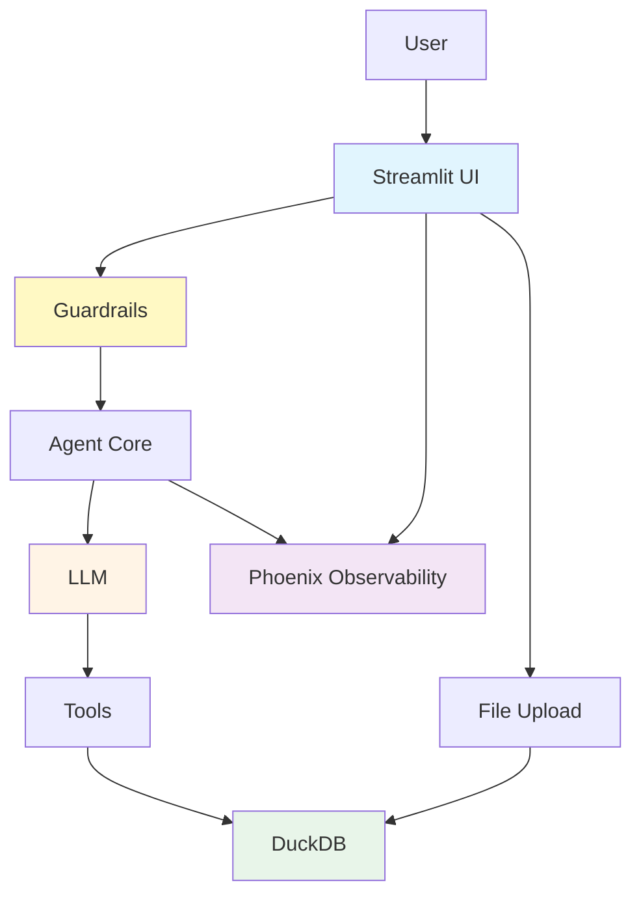

### Detailed Component Architecture

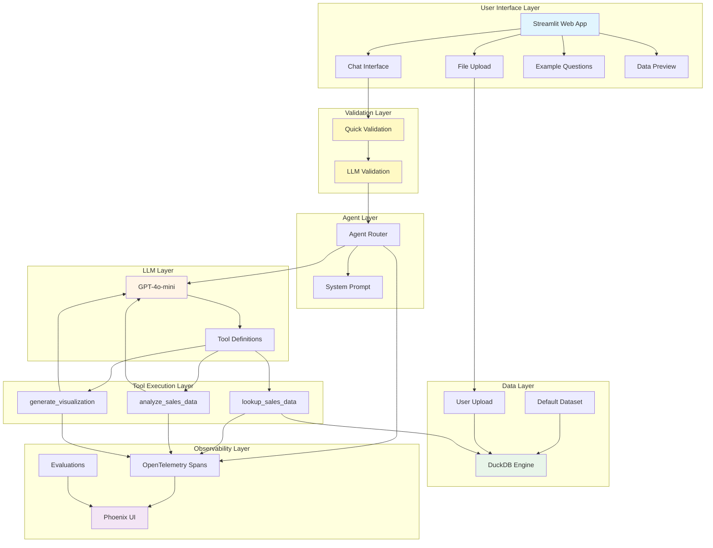

## Goals and intended uses

This project serves multiple purposes for developers, data scientists, and AI engineers:

### Primary Goals

1. **Demonstrate Practical Agent Patterns**: 
   - Showcase a real-world implementation of LLM function-calling combined with deterministic data processing tools
   - Illustrate best practices for routing between LLM reasoning and structured query execution
   - Provide patterns for handling multi-step agent workflows with proper state management

2. **Comprehensive Observability Implementation**:
   - Show how to add full OpenTelemetry instrumentation to an LLM-powered system
   - Demonstrate integration with Phoenix for trace collection, visualization, and analysis
   - Illustrate proper span creation, attribute attachment, and error handling in production-like scenarios

3. **Automated Evaluation Framework**:
   - Implement LLM-as-a-judge evaluation patterns for agent behavior assessment
   - Show how to evaluate different aspects: tool selection, SQL quality, code correctness, and response clarity
   - Demonstrate how to log evaluation results back to the observability platform for trend analysis

4. **Executable Learning Resource**:
   - Provide a complete, runnable example that can be studied, modified, and extended
   - Include real data and realistic use cases for retail analytics
   - Serve as a starting point for experiments in agentic systems, model evaluation, and instrumentation

5. **Interactive Web Interface**:
   - Demonstrate how to build user-friendly interfaces for LLM agents using Streamlit
   - Show proper integration of guardrails and validation in production-like applications
   - Illustrate file upload handling and dynamic data source switching
   - Provide patterns for session state management in conversational interfaces

### Intended Use Cases

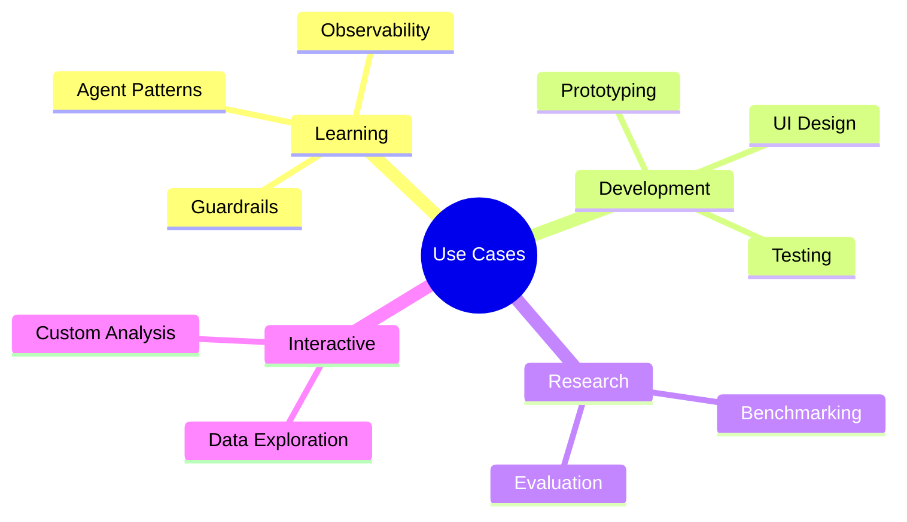

### Non-Goals (Out of Scope)

- **Production-ready deployment**: This is a reference implementation, not production-hardened code
- **Multi-user authentication/authorization**: No security layer included
- **Scalability beyond single-node**: Designed for local execution, not distributed systems
- **Complex data pipeline orchestration**: Focuses on analysis, not ETL workflows
- **Real-time streaming analytics**: Batch-oriented Parquet file analysis only

## Project structure (important files)

```
parquet-pilot/
├── data_analyst/
│   ├── main.py                 # Evaluation runner that triggers end-to-end agent runs
│   ├── agent_core.py           # Refactored agent core (no auto-execution, for imports)
│   ├── utils.py                # Original full implementation with example auto-execution
│   ├── helper.py               # Environment helpers (dotenv loader, API key helper)
│   ├── streamlit_app.py        # Interactive Streamlit web interface
│   └── data/                   # Parquet dataset used by the agent
├── docker-compose.yml          # Phoenix observability container configuration
├── requirements.txt            # Python dependencies
├── Architecture.md             # Comprehensive architecture documentation
├── README.md                   # Project README
└── LICENSE
```

### File Implementation Notes

**agent_core.py vs utils.py**:

Both files contain functionally identical implementations of the agent with the same tools, router logic, and instrumentation. The key difference is execution behavior:

| Aspect | agent_core.py | utils.py |
|--------|--------------|----------|
| **Purpose** | Clean module for imports | Teaching/demo with examples |
| **Auto-execution** | None | Runs 4 examples on import |
| **Import safety** | ✅ Safe | ⚠️ Triggers API calls |
| **Used by** | streamlit_app.py | main.py (for compatibility) |
| **Print statements** | Minimal | Verbose with debug output |
| **Recommended for** | Production, new code | Learning, demonstrations |

**What auto-executes in utils.py**:
1. `lookup_sales_data("Show me all the sales for store 1320 on November 1st, 2021")`
2. `analyze_sales_data(prompt="what trends do you see", data=example_data)`
3. `generate_visualization()` + `exec(code)` - displays matplotlib chart
4. `start_main_span([{"role": "user", "content": "Which stores did the best in 2021?"}])`

All examples print results to console and create spans in Phoenix.

## How it works — step-by-step

The agent operates through a sophisticated orchestration pattern that combines LLM reasoning with deterministic tool execution. Here's a detailed breakdown of the request lifecycle:

### Request Processing Flow

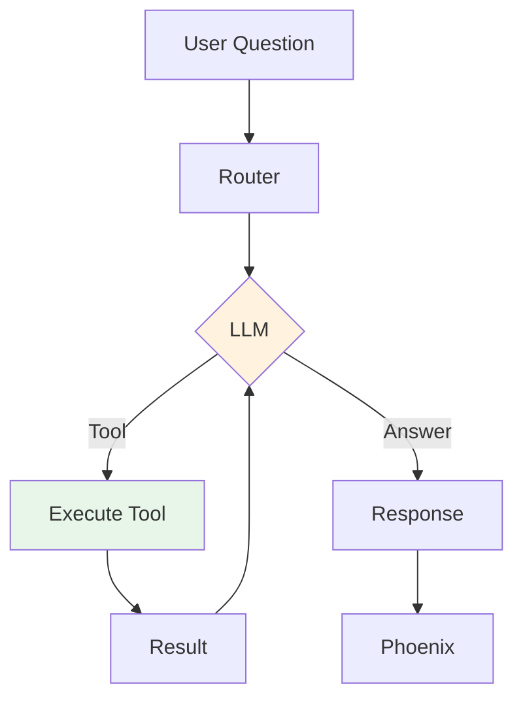

### Detailed Step-by-Step Process

1. **Request Initialization**
   - User submits a natural-language question (e.g., "What were the top 5 products by revenue last quarter?")
   - System initializes a message context with user role and content
   - System prompt is attached, providing the agent with its identity, capabilities, and operational guidelines

2. **Router Orchestration** (`agent_core.py::run_agent` or `utils.py::run_agent`)
   - Router sends the conversation to OpenAI's API with:
     - Current messages (conversation history)
     - Tool schemas (JSON descriptions of available functions)
     - Model configuration (gpt-4o-mini)
   - Creates a root span for observability tracking

3. **LLM Decision Making**
   - The LLM analyzes the request and available tools
   - Decides whether to:
     - Call one or more tools (function calling)
     - Return a direct natural-language answer
   - If tools are needed, specifies function name and arguments

4. **Tool Execution** (detailed for each tool)

   **A. `lookup_sales_data(prompt: str)`**
   ```mermaid
   sequenceDiagram
       Router->>Tool: prompt
       Tool->>DuckDB: Read & Query
       Tool->>LLM: Generate SQL
       LLM-->>Tool: SQL
       Tool->>DuckDB: Execute
       DuckDB-->>Router: Results
   ```
   
   - Reads the Parquet file (`Store_Sales_Price_Elasticity_Promotions_Data.parquet`) into a Pandas DataFrame
   - Creates an in-memory DuckDB table named `sales` from the DataFrame
   - Invokes `generate_sql_query()` which:
     - Constructs a prompt with available columns and table schema
     - Sends to LLM requesting SQL query generation
     - Validates and returns SQL query string
   - Executes the SQL via DuckDB and captures results
   - Returns results as formatted string
   - All operations wrapped in `@tracer.tool()` span

   **B. `analyze_sales_data(prompt: str, data: str)`**
   ```mermaid
   graph LR
       A[Input] --> B[LLM]
       B --> C[Analysis]
       style B fill:#fff4e6
   ```
   
   - Takes the user's prompt and the data string (typically from a prior lookup)
   - Constructs an analysis prompt that includes the data context
   - Sends to LLM for interpretation and narrative generation
   - Returns human-readable insights and observations
   - Decorated with `@tracer.tool()` for observability

   **C. `generate_visualization(data: str, visualization_goal: str)`**
   ```mermaid
   graph LR
       A[Input] --> B[LLM Config]
       B --> C[LLM Code]
       C --> D[Output]
       style B fill:#fff4e6
       style C fill:#fff4e6
   ```
   
   - Extracts a chart configuration using `client.beta.chat.completions.parse()` with `response_format=VisualizationConfig` (Pydantic model)
   - Configuration specifies: chart type, title, axis labels, colors, etc.
   - Invokes another LLM call to generate actual matplotlib plotting code
   - Returns executable Python code as a string
   - Uses `@tracer.chain()` for helper methods and `@tracer.tool()` for the main tool

5. **Tool Result Processing**
   - Tool output is appended to the conversation as a tool message:
     ```python
     {"role": "tool", "content": result, "tool_call_id": tool_call.id}
     ```
   - Router continues the conversation loop, sending updated messages back to LLM
   - LLM can make additional tool calls or return a final answer

6. **Span Creation and Metadata**
   - Every tool call creates an OpenTelemetry span with:
     - `span.name`: function name (e.g., "lookup_sales_data")
     - `input.value`: tool arguments (e.g., user prompt)
     - `output.value`: tool return value (truncated if large)
     - `openinference.span_kind`: "tool", "chain", or "agent"
     - `status.code`: "OK" or "ERROR"
     - `error.message`: exception details (if applicable)

7. **Completion and Response**
   - When LLM returns a response without tool calls, the router:
     - Captures the final message content
     - Closes all active spans
     - Sends traces to Phoenix collector (http://localhost:6006/v1/traces)
     - Returns the final answer to the user

8. **Observability Pipeline**
   - Phoenix collector receives spans in real-time
   - Spans are indexed and made available in the Phoenix UI
   - Evaluation runner can query spans for LLM-as-a-judge processing
   - Results are logged back to Phoenix for visualization

### Tool Selection Decision Tree

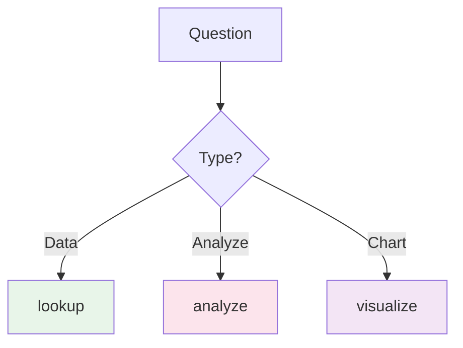

## Streamlit User Interface

The system includes a comprehensive web interface built with Streamlit (`streamlit_app.py`) that provides an intuitive way to interact with the data analyst agent.

### User Interaction Flow

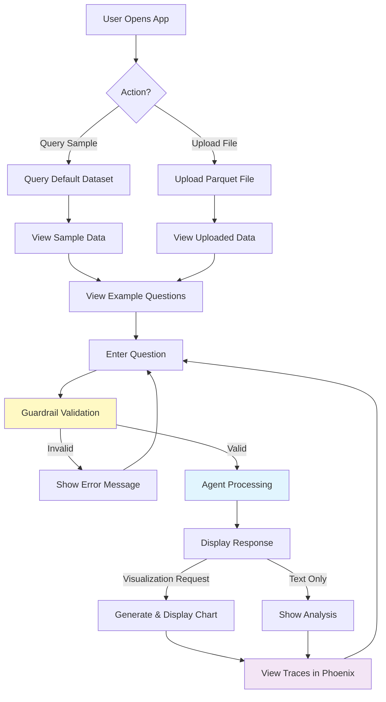

### Key Features

#### 1. Sample Data Exploration
- **Default Dataset**: Users can immediately query the pre-loaded Store Sales Price Elasticity Promotions dataset
- **Schema Viewer**: Expandable section showing:
  - Total record count
  - Column names and data types
  - Sample values for each column
  - First 5 rows of data
- **Query Ideas**: Suggestions for types of analyses users can perform

#### 2. Custom Data Upload

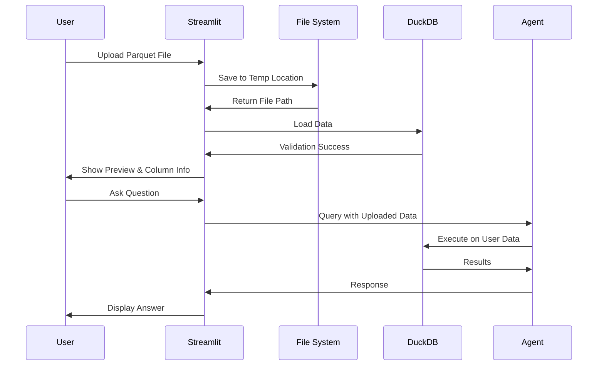

**Upload Process**:
1. User selects Parquet file via sidebar uploader
2. File is validated and saved to temporary location
3. Data is loaded into pandas DataFrame
4. Preview shows row count, column count, and first 10 rows
5. Session state tracks uploaded file for all subsequent queries
6. Users can switch back to default dataset at any time

#### 3. Smart Guardrails System

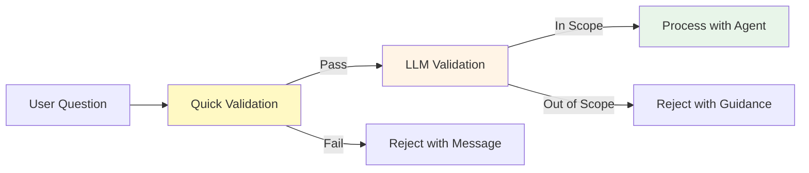

**Two-Tier Validation**:

**Quick Validation** (Keyword-based):
- Blocks harmful patterns (hack, exploit, jailbreak, etc.)
- Rejects questions under 3 characters
- Limits questions to 1000 characters
- Fast pre-check before LLM validation

**LLM Validation** (Semantic):
- Uses GPT-4o-mini to determine if question is within scope
- Validates against allowed topics:
  - Store performance and sales metrics
  - Product sales, SKUs, and categories
  - Transaction data and revenue
  - Promotional campaigns and impact
  - Price elasticity and pricing data
  - Sales trends over time
  - Geographic/regional analysis
- Provides helpful error messages for out-of-scope questions
- Returns structured VALID/INVALID response

#### 4. Predefined Example Questions

**Sidebar Panel** features clickable example questions:
- "What was the most popular product SKU?"
- "What was the total revenue across all stores?"
- "Which store had the highest sales volume?"
- "Create a bar chart showing total sales by store"
- "What percentage of items were sold on promotion?"
- "What was the average transaction value?"
- "Show me sales trends for the top 5 products"

Clicking an example automatically populates the chat input and submits the query.

#### 5. Phoenix Observability Integration

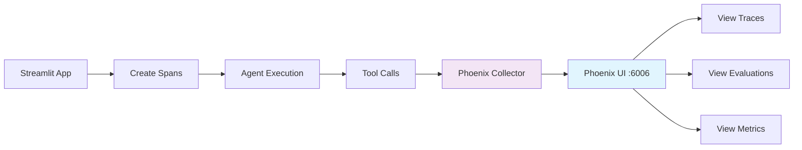

**Trace Visibility**:
- All agent operations are instrumented with OpenTelemetry
- Sidebar provides direct link to Phoenix UI (localhost:6006)
- Project name: `evaluating-agent`
- Users can trace:
  - Complete conversation flows
  - Tool selection decisions
  - SQL query generation and execution
  - Visualization code generation
  - Error states and exceptions
  - Performance metrics (latency, token usage)

#### 6. Interactive Chat Interface

**Features**:
- Persistent conversation history within session
- Clear visual distinction between user and assistant messages
- Real-time processing indicators (spinners)
- Inline visualization rendering for charts
- Active dataset indicator (shows which data is being queried)
- Clear conversation button to reset state

**Visualization Handling**:
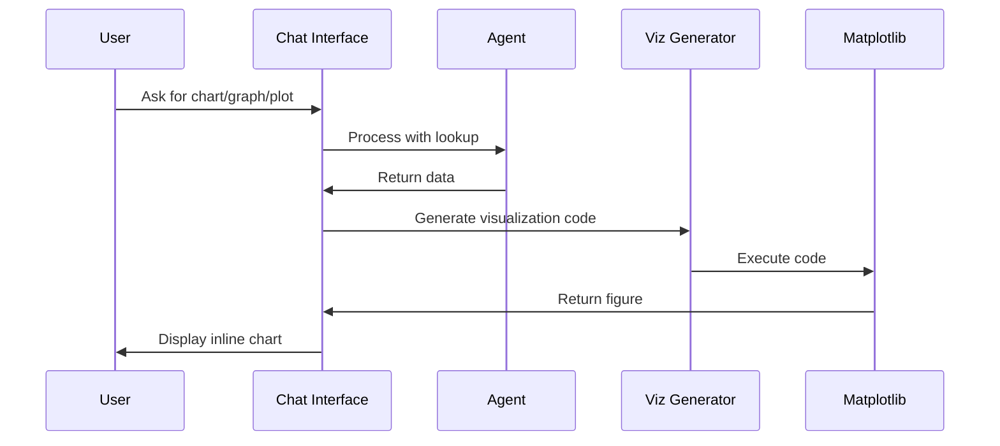

Keywords that trigger visualization: chart, graph, plot, visualize, visualization, show me

### Session State Management

Streamlit maintains the following session state:

```python
{
    "messages": [],                    # Chat display messages
    "conversation_history": [],        # Agent conversation context
    "uploaded_file_path": None,        # Temp file path
    "uploaded_file_name": None,        # Original filename
    "uploaded_df": None,               # Loaded DataFrame
    "example_clicked": None            # Clicked example question
}
```

### Custom Agent Integration

The Streamlit app imports from `agent_core.py` (the clean, non-auto-executing version) and extends it with file upload capabilities.

**File-Aware Agent Functions**:

1. **`lookup_data_with_upload()`**: Modified lookup tool that:
   - Checks for uploaded file in session state
   - Falls back to default dataset if none uploaded
   - Creates DuckDB table from appropriate source
   - Maintains same tool interface for LLM

2. **`run_agent_with_upload()`**: Custom agent runner that:
   - Uses uploaded file when available
   - Updates system prompt based on active dataset
   - Maintains full tool-calling loop functionality
   - Preserves observability spans

3. **`start_agent_with_upload()`**: Wrapper that:
   - Creates root span for observability
   - Tracks inputs and outputs
   - Handles errors gracefully

### User Experience Flow

**Typical User Journey**:

1. **Initial Exploration**:
   - User opens app and sees default dataset preview
   - Reviews sample data schema and column types
   - Reads example questions in sidebar
   - Clicks an example to see agent in action

2. **Testing Capabilities**:
   - User experiments with natural language queries
   - Requests various analysis types (aggregations, trends, comparisons)
   - Asks for visualizations (charts, graphs, plots)
   - Observes agent tool selection and reasoning

3. **Custom Data Analysis**:
   - User uploads their own Parquet file
   - Reviews uploaded data preview
   - Adapts questions to their specific dataset
   - Performs domain-specific analysis

4. **Observability & Debugging**:
   - User encounters unexpected results
   - Opens Phoenix UI to trace agent execution
   - Examines tool calls, SQL queries, and LLM responses
   - Refines questions based on insights

### Error Handling

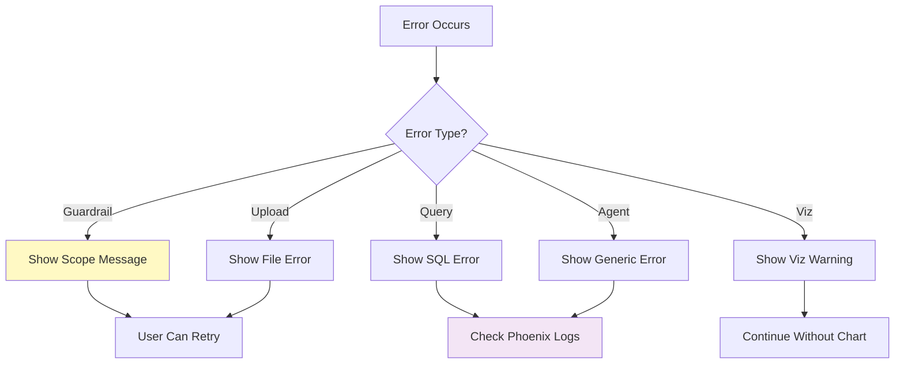

**Error Types Handled**:
- Guardrail rejections → Clear guidance on acceptable questions
- File upload failures → Validation error messages
- SQL execution errors → Captured in spans, displayed to user
- Visualization errors → Warning displayed, text response shown
- Agent exceptions → Generic error message, full trace in Phoenix

## Implementation details

The following details were confirmed by inspecting the project's source files (`data_analyst/agent_core.py`, `data_analyst/utils.py`, `data_analyst/main.py`, and `data_analyst/helper.py`). These are concrete names, constants, and behaviors you should be aware of when running or extending the project.

### Core Dependencies and Configuration

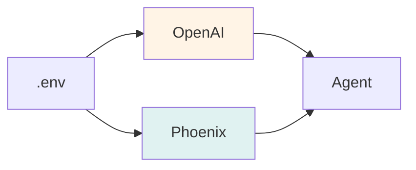

#### OpenAI Client and Model Configuration

- **Client Initialization**: 
  ```python
  from openai import OpenAI
  client = OpenAI(api_key=openai_api_key)
  ```
  Located in both `data_analyst/agent_core.py` and `data_analyst/utils.py`

- **Model Constants**:
  - Primary model: `MODEL = "gpt-4o-mini"` (used for agent operations)
  - Evaluation model: `OpenAIModel(model="gpt-4o")` (used for LLM-as-a-judge in `main.py`)
  - The evaluation model is more capable for complex reasoning tasks

#### Phoenix and Tracing Setup

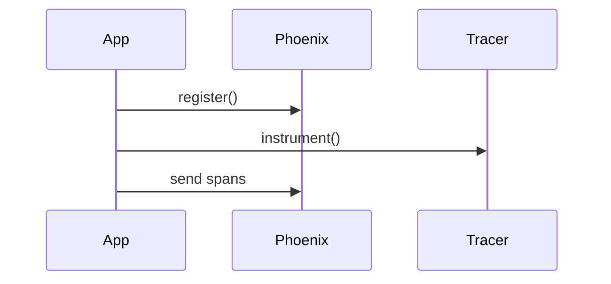

- **Tracer Registration**:
  ```python
  phoenix.otel.register(
      project_name=PROJECT_NAME,
      endpoint="http://localhost:6006/v1/traces"
  )
  ```

- **Project Configuration**:
  - `PROJECT_NAME = "evaluating-agent"` (defined in `agent_core.py`, `utils.py`, and `main.py`)
  - All spans are tagged with this project name for filtering in Phoenix UI

- **OpenAI Instrumentation**:
  ```python
  OpenAIInstrumentor().instrument(tracer_provider=tracer_provider)
  tracer = tracer_provider.get_tracer(__name__)
  ```
  - Automatically captures all OpenAI API calls as spans
  - Includes token usage, latency, and error information

#### Data File Configuration

- **Parquet File Path**:
  ```python
  TRANSACTION_DATA_FILE_PATH = 'data/Store_Sales_Price_Elasticity_Promotions_Data.parquet'
  ```
  Defined in both `agent_core.py` and `utils.py`

- **Expected Schema**: The dataset should contain retail transaction fields:
  - Store identifiers (store_id, region, etc.)
  - Product information (product_sku, category, etc.)
  - Transaction details (transaction_id, transaction_date, quantity, price, revenue)
  - Promotional flags (on_promotion, discount_percentage, etc.)

### Tool Implementations

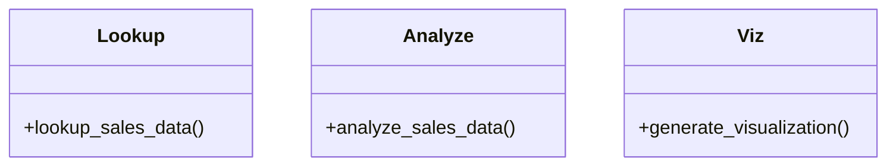

#### 1. lookup_sales_data(prompt: str)

**Purpose**: Retrieve data from Parquet files using SQL queries generated by the LLM

**Implementation Flow**:
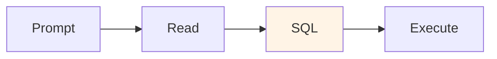

**Key Details**:
- Decorated with `@tracer.tool()` for automatic span creation
- Creates a fresh DuckDB connection for each query
- Table name is always `sales` (hardcoded in SQL generation prompt)
- Returns results as formatted string (not DataFrame) for LLM consumption

**Error Handling**:
- Parquet file not found → FileNotFoundError with span marked ERROR
- SQL syntax error → DuckDB exception captured in span
- Column mismatch → Logged as warning, may cause query failure

#### 2. analyze_sales_data(prompt: str, data: str)

**Purpose**: Generate narrative insights and interpretations from query results

**Implementation Flow**:
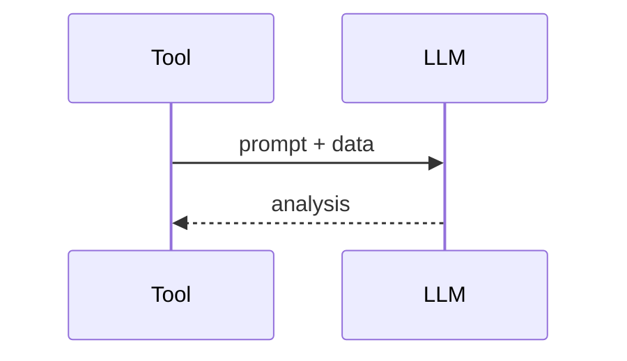

**Key Details**:
- Simpler than lookup tool - direct LLM call with formatted prompt
- Includes both the original question and the data in context
- Returns plain text analysis (not structured data)
- Decorated with `@tracer.tool()`

**Prompt Template**:
```
Based on the following data:
{data}

{prompt}

Provide a clear, concise analysis focusing on key insights and actionable recommendations.
```

#### 3. generate_visualization(data: str, visualization_goal: str)

**Purpose**: Generate executable Python plotting code for data visualization

**Implementation Flow**:
```mermaid
graph TD
    A[Receive data + goal] --> B[@tracer.tool decorator]
    B --> C[extract_chart_config helper]
    C --> D[LLM: parse to VisualizationConfig]
    D --> E[Validate Pydantic model]
    E --> F[create_chart helper]
    F --> G[LLM: generate plotting code]
    G --> H[Extract code block]
    H --> I[Add necessary imports]
    I --> J[Log code to span]
    J --> K[Return executable code]
    
    style D fill:#fff4e6
    style G fill:#fff4e6
    style B fill:#e0f2f1
```

**VisualizationConfig Model** (Pydantic):
```python
class VisualizationConfig(BaseModel):
    chart_type: str  # bar, line, scatter, pie, etc.
    title: str
    x_label: str
    y_label: str
    colors: List[str]
    # ... additional configuration
```

**Key Details**:
- Uses `client.beta.chat.completions.parse()` with `response_format=VisualizationConfig`
- Two-step process: config extraction → code generation
- Helper methods decorated with `@tracer.chain()`
- Returns runnable code as string, not executed directly
- Code includes matplotlib imports and data preparation

### Router Behavior and Tool-Calling Loop

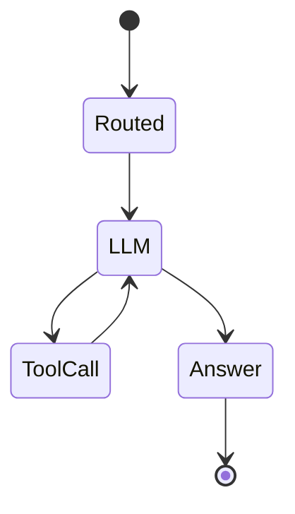

**run_agent(messages) Function**:

1. **System Prompt Injection**:
   - Ensures first message has `role: "system"`
   - Provides agent identity and capabilities

2. **LLM Invocation**:
   ```python
   response = client.chat.completions.create(
       model=MODEL,
       messages=messages,
       tools=tools
   )
   ```

3. **Tool Call Inspection**:
   ```python
   tool_calls = response.choices[0].message.tool_calls
   if tool_calls:
       handle_tool_calls(tool_calls, messages)
   else:
       return response.choices[0].message.content
   ```

4. **Tool Mapping**:
   ```python
   tool_implementations = {
       "lookup_sales_data": lookup_sales_data,
       "analyze_sales_data": analyze_sales_data,
       "generate_visualization": generate_visualization
   }
   ```

5. **Iterative Execution**:
   - Continues until no more tool calls are requested
   - Each iteration appends tool results to messages
   - Maximum iterations: implicit (no hard limit set)

### Tool Function Schemas

The `tools` list contains JSON schemas describing each function to the LLM:

```json
[
  {
    "type": "function",
    "function": {
      "name": "lookup_sales_data",
      "description": "Retrieve sales data by generating and executing SQL queries against the Parquet dataset",
      "parameters": {
        "type": "object",
        "properties": {
          "prompt": {
            "type": "string",
            "description": "Natural language description of the data to retrieve"
          }
        },
        "required": ["prompt"]
      }
    }
  },
  // ... similar schemas for other tools
]
```

### Important Runtime Side-Effects

⚠️ **Critical for Maintainers**:

**Two versions of the agent implementation exist**:

1. **`agent_core.py`** (Refactored - No Auto-Execution):
   - Clean module designed for imports
   - Contains all tool implementations and agent logic
   - Does NOT execute examples at import time
   - Safe to import in other modules (e.g., `streamlit_app.py`)
   - Recommended for production use and imports

2. **`utils.py`** (Original - With Auto-Execution):
   - Original implementation with example calls at module level
   - Executes demonstration queries when imported or run
   - Example calls include:
     ```python
     # Auto-executes on import:
     example_data = lookup_sales_data("Show me all the sales for store 1320...")
     print(example_data)
     
     print(analyze_sales_data(prompt="what trends...", data=example_data))
     
     code = generate_visualization(example_data, "A bar chart...")
     exec(code)  # Executes matplotlib code!
     
     result = start_main_span([{"role": "user", "content": "Which stores..."}])
     ```

**Implications when importing `utils.py`**:
- Requires valid `OPENAI_API_KEY`
- Requires Parquet file at expected path
- Makes OpenAI API calls (costs money)
- Executes `exec(code)` for visualization
- Creates spans in Phoenix
- May display matplotlib plots

**Recommendation**: 
- Use `agent_core.py` for imports and production code
- Use `utils.py` only for learning/demonstration purposes
- `streamlit_app.py` correctly imports from `agent_core.py`

### Evaluation Pipeline Architecture

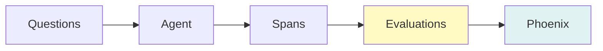

**Test Questions Set** (`agent_questions` in `main.py`):
```python
agent_questions = [
    "What was the most popular product SKU?",
    "What was the total revenue across all stores?",
    "Which store had the highest sales volume?",
    "Create a bar chart showing total sales by store",
    "What percentage of items were sold on promotion?",
    "What was the average transaction value?"
]
```

**Evaluation Types** (implemented in `main.py`):

1. **Tool Calling Evaluation** (`Tool Calling Eval`):
   - Validates correct tool choice for task type using Phoenix's `TOOL_CALLING_PROMPT_TEMPLATE`
   - Queries spans where `span_kind == 'LLM'` with tool calls
   - Labels: "correct", "incorrect"
   - Uses GPT-4o as judge with `llm_classify()`
   - Provides explanations for decisions

2. **SQL Correctness Evaluation** (`SQL Gen Eval`):
   - Validates generated SQL matches intent using custom `SQL_EVAL_GEN_PROMPT`
   - Filters LLM spans containing "Generate an SQL query based on a prompt."
   - Evaluates based on instruction, generated query, and response
   - Labels: "correct", "incorrect"
   - Uses GPT-4o as judge

3. **Code Runnability Evaluation** (`Runnable Code Eval`):
   - Attempts to execute generated visualization code using `exec()`
   - Queries spans where `name == 'generate_visualization'`
   - Extracts code from `output.value`
   - Labels: "runnable", "not_runnable"
   - Pure Python execution test (no LLM judge)

4. **Response Clarity Evaluation** (`Response Clarity`):
   - Assesses response quality and coherence using custom `CLARITY_LLM_JUDGE_PROMPT`
   - Queries spans where `span_kind == 'AGENT'`
   - Evaluates both query and response
   - Labels: "clear", "unclear"
   - Uses GPT-4o as judge with detailed reasoning

**Evaluation Execution Flow** (from `main.py`):
```python
# 1. Run agent on all test questions
for question in tqdm(agent_questions, desc="Processing questions"):
    ret = start_main_span([{"role": "user", "content": question}])

# 2. Query spans from Phoenix
query = SpanQuery().where("span_kind == 'LLM'").select(...)
tool_calls_df = px.Client().query_spans(query, project_name=PROJECT_NAME)

# 3. Run LLM-based evaluation with tracing suppressed
with suppress_tracing():
    tool_call_eval = llm_classify(
        dataframe=tool_calls_df,
        template=TOOL_CALLING_PROMPT_TEMPLATE.template[0].template,
        rails=['correct', 'incorrect'],
        model=OpenAIModel(model="gpt-4o"),
        provide_explanation=True
    )

# 4. Add scores and log back to Phoenix
tool_call_eval['score'] = tool_call_eval.apply(
    lambda x: 1 if x['label']=='correct' else 0, axis=1
)

px.Client().log_evaluations(
    SpanEvaluations(eval_name="Tool Calling Eval", dataframe=tool_call_eval)
)
```

This pattern repeats for all four evaluation types, each querying different spans and using appropriate templates.

**Code Runnability Check** (unique approach):
```python
def code_is_runnable(output: str) -> bool:
    """Check if the code is runnable"""
    output = output.strip()
    output = output.replace("```python", "").replace("```", "")
    try:
        exec(output)
        return True
    except Exception as e:
        return False

# Applied directly to dataframe
code_gen_df["label"] = code_gen_df["generated_code"].apply(code_is_runnable).map({
    True: "runnable", 
    False: "not_runnable"
})
code_gen_df["score"] = code_gen_df["label"].map({
    "runnable": 1, 
    "not_runnable": 0
})
```

Unlike the other evaluations, code runnability uses direct Python execution rather than an LLM judge.

### Environment Helpers

**helper.py Functions**:

```python
def load_env():
    """Load environment variables from .env file"""
    _ = load_dotenv(find_dotenv(), override=True)

def get_openai_api_key() -> str:
    """Load OpenAI API key from .env or environment"""
    load_env()
    openai_api_key = os.getenv("OPENAI_API_KEY")
    return openai_api_key

def get_phoenix_endpoint() -> str:
    """Get Phoenix collector endpoint from environment"""
    load_env()
    phoenix_endpoint = os.getenv("PHOENIX_COLLECTOR_ENDPOINT")
    return phoenix_endpoint
```

**Note**: The `get_phoenix_endpoint()` function returns the raw value from environment (may be `None`). The default endpoint `http://localhost:6006/v1/traces` is set directly in `agent_core.py` and `utils.py` via the `register()` call.

### SDK Compatibility Notes

**Required SDK Features**:
- `client.chat.completions.create()` - Standard chat completions
- `client.beta.chat.completions.parse()` - Structured output parsing
- `response_format=PydanticModel` - Pydantic model support
- `tools` parameter - Function calling support

**Version Recommendations**:
- `openai>=1.0.0` (for beta features and Pydantic support)
- Check compatibility with structured outputs feature availability

**Troubleshooting**:
- `AttributeError: 'OpenAI' object has no attribute 'beta'` → Upgrade OpenAI SDK
- `TypeError: create() got an unexpected keyword argument 'response_format'` → Update to SDK version supporting structured outputs


## High-level agent workflow (Mermaid flowchart)

```mermaid
flowchart TD
  A[User question] --> B[Router (system prompt + tools)]
  B --> C{LLM decision}
  C -- calls lookup_sales_data --> D[Read Parquet (Pandas) & create DuckDB table]
  D --> E[LLM: generate SQL] --> F[DuckDB: execute SQL] --> G[Query Result]
  C -- calls analyze_sales_data --> H[LLM: analyze result] --> I[Analysis text]
  C -- calls generate_visualization --> J[LLM: chart config] --> K[LLM: emit Python code] --> L[Runnable code]
  G --> H
  G --> J
  H --> M[Router collates outputs]
  L --> M
  M --> N[Final answer returned to user]
  M --> O[Spans & metrics logged to Phoenix]
```

## Architecture diagram (Mermaid)

```mermaid
flowchart LR
  subgraph AgentHost
    direction TB
    Agent[Python Agent<br/>agent_core.py / utils.py]
    Agent -->|Uses| OpenAI[OpenAI API]
    Agent -->|Queries| DuckDB[DuckDB (in-process SQL)]
    Agent -->|Reads| Parquet[Parquet files (data_analyst/data/)]
  end

  subgraph Observability
    direction TB
    Phoenix[Phoenix (collector + UI)]
    Phoenix -->|UI| Browser[User's Browser]
  end

  OpenAI -- model responses --> Agent
  DuckDB -- results --> Agent
  Agent -- traces/metrics --> Phoenix
  Browser -- view UI --> Phoenix

  style Phoenix fill:#f5f7ff,stroke:#3b82f6
  style OpenAI fill:#fff7ed,stroke:#fb923c
```

## Running locally (Windows PowerShell)

This section provides step-by-step instructions for setting up and running Parquet Pilot on Windows using PowerShell.

### Prerequisites

```mermaid
graph LR
    A[Windows] --> B[Python 3.8+]
    A --> C[Docker]
    A --> D[Git]
```

**Verify Prerequisites**:
```powershell
# Check PowerShell version
$PSVersionTable.PSVersion

# Check Python version
python --version

# Check Docker
docker --version

# Check Git
git --version
```

### Installation and Setup

#### Step 1: Clone the Repository

```powershell
# Navigate to your projects directory
cd E:\Code\Git

# Clone the repository
git clone https://github.com/rkrmishra/parquet-pilot.git

# Navigate to project directory
cd parquet-pilot
```

#### Step 2: Start the Observability Stack

```mermaid
sequenceDiagram
    User->>Docker: docker-compose up -d
    Docker->>Phoenix: Start container
    Phoenix-->>User: Ready on :6006
```

**Commands**:
```powershell
# Start Phoenix in detached mode
docker-compose up -d

# Verify services are running
docker ps

# Expected output:
# CONTAINER ID   IMAGE                     STATUS         PORTS
# abc123def456   arizephoenix/phoenix      Up 2 minutes   0.0.0.0:6006->6006/tcp

# Check Phoenix logs
docker-compose logs -f phoenix

# Stop services (when done)
docker-compose down
```

**Troubleshooting Docker**:
```mermaid
graph TD
    A[Issue?] --> B{Error Type}
    B -->|Port in use| C[Stop process]
    B -->|Won't start| D[Check Docker]
    B -->|Pull fails| E[Check network]
```

#### Step 3: Configure API Keys and Environment

```mermaid
graph LR
    A[API Key] --> B[.env file]
    A --> C[$env variable]
    B --> D[Loaded]
    C --> D
    
    style B fill:#e8f5e9
```

**Option 1: .env File (Recommended)**:
```powershell
# Create .env file in project root
New-Item -Path .env -ItemType File

# Edit .env file (using notepad or your preferred editor)
notepad .env
```

Add to `.env`:
```bash
OPENAI_API_KEY=sk-proj-your-actual-api-key-here
PHOENIX_COLLECTOR_ENDPOINT=http://localhost:6006/v1/traces
```

**Option 2: PowerShell Session Variable**:
```powershell
# Set for current PowerShell session only
$env:OPENAI_API_KEY = "sk-proj-your-actual-api-key-here"

# Verify it's set
$env:OPENAI_API_KEY
```

**Option 3: System Environment Variable** (persistent):
```powershell
# Set system-wide (requires admin)
[System.Environment]::SetEnvironmentVariable(
    'OPENAI_API_KEY',
    'sk-proj-your-actual-api-key-here',
    [System.EnvironmentVariableTarget]::User
)

# Restart PowerShell to pick up changes
```

#### Step 4: Create and Activate Virtual Environment

```mermaid
graph LR
    A[Create venv] --> B[Activate]
    B --> C[Install deps]
```

**Commands**:
```powershell
# Create virtual environment
python -m venv venv

# Activate (PowerShell)
.\venv\Scripts\Activate.ps1

# If you get execution policy error:
Set-ExecutionPolicy -ExecutionPolicy RemoteSigned -Scope CurrentUser

# Then try activating again
.\venv\Scripts\Activate.ps1

# Your prompt should now show (venv)
# (venv) PS E:\Code\Git\parquet-pilot>

# To deactivate later:
deactivate
```

**Common Issues**:

| Error | Solution |
|-------|----------|
| `Activate.ps1 cannot be loaded` | Run `Set-ExecutionPolicy RemoteSigned` |
| `python not found` | Add Python to PATH or use `py` instead |
| `venv folder exists` | Delete and recreate: `Remove-Item -Recurse venv` |

#### Step 5: Install Dependencies

```mermaid
sequenceDiagram
    User->>Pip: install -r requirements.txt
    Pip->>PyPI: Download packages
    PyPI-->>User: Installed
```

**Commands**:
```powershell
# Ensure venv is activated (you should see (venv) in prompt)

# Upgrade pip to latest version
python -m pip install --upgrade pip

# Install all dependencies
pip install -r requirements.txt

# Verify installation
pip list

# Expected packages (partial list):
# openai>=1.0.0
# pandas
# duckdb
# arize-phoenix
# opentelemetry-api
# python-dotenv
```

**If requirements.txt is missing**, install manually:
```powershell
pip install openai pandas duckdb arize-phoenix opentelemetry-api python-dotenv matplotlib pydantic streamlit
```

**Key Dependencies Explained**:
- `openai` - OpenAI API client for GPT models
- `pandas` - DataFrame operations and data manipulation
- `duckdb` - In-memory SQL engine for Parquet queries
- `arize-phoenix` - Observability platform for LLM applications
- `opentelemetry-api` - OpenTelemetry instrumentation
- `python-dotenv` - Environment variable management
- `matplotlib` - Visualization library
- `pydantic` - Data validation and schema definition
- `streamlit` - Web interface framework

#### Step 6: Verify Phoenix UI Access

```mermaid
graph LR
    A[Browser] --> B[localhost:6006]
    B --> C{Loads?}
    C -->|Yes| D[Ready]
    C -->|No| E[Check logs]
```

**Access Phoenix UI**:
```powershell
# Open your browser and navigate to:
# http://localhost:6006

# Or use PowerShell to open automatically:
Start-Process "http://localhost:6006"
```

**Expected Phoenix UI**:
- Projects list (initially empty)
- Navigation menu with Traces, Evaluations, etc.
- Status indicator showing collector is running

### Running the Application

#### Option A: Interactive Web Interface (Recommended)

The Streamlit web interface provides the most user-friendly way to interact with Parquet Pilot.

```mermaid
graph LR
    A[cd data_analyst] --> B[streamlit run]
    B --> C[Web Browser]
    C --> D[Upload & Query]
    D --> E[View Results]
    E --> F[Phoenix Traces]
    
    style C fill:#e1f5fe
    style F fill:#f3e5f5
```

**Commands**:
```powershell
# Navigate to data_analyst directory
cd data_analyst

# Run the Streamlit application
streamlit run streamlit_app.py

# Expected output:
# You can now view your Streamlit app in your browser.
# Local URL: http://localhost:8501
# Network URL: http://192.168.x.x:8501
```

**Access the Application**:
- Open browser to `http://localhost:8501`
- Interface loads with default dataset preview
- Use sidebar to explore features:
  - Upload your own Parquet file
  - Click example questions
  - Access Phoenix observability link
  - Clear conversation history

**Key Features Available**:
- Query pre-loaded sample data immediately
- Upload custom Parquet files for analysis
- View dataset schemas and sample rows
- Get suggestions from predefined questions
- See real-time agent processing
- View inline visualizations
- Trace execution in Phoenix UI

**Stopping the Application**:
```powershell
# Press Ctrl+C in the terminal to stop the Streamlit server
```

#### Option B: Run Evaluation Pipeline (Full System Test)

```mermaid
graph LR
    A[cd data_analyst] --> B[python main.py]
    B --> C[6 questions]
    C --> D[Evaluations]
    D --> E[Phoenix UI]
    
    style D fill:#fff9c4
```

**Commands**:
```powershell
# Navigate to data_analyst directory
cd data_analyst

# Run the evaluation pipeline
python main.py

# Expected output:
# Processing question 1/6: What was the most popular product SKU?
# Tool called: lookup_sales_data
# Processing question 2/6: Show me total revenue by store
# ...
# Running evaluations...
# Evaluations logged to Phoenix
```

**What Happens**:
1. Loads 6 pre-defined test questions
2. For each question:
   - Calls the agent
   - Agent uses tools to answer
   - Creates spans in Phoenix
3. Runs 4 evaluation types:
   - Tool selection accuracy
   - SQL correctness
   - Code runnability
   - Response clarity
4. Logs all evaluation results to Phoenix

#### Option C: Interactive Agent Session (Single Query)

```mermaid
graph LR
    A[python utils.py] --> B[Auto-execute examples]
    B --> C[Display results]
    C --> D[Optional: Interactive shell]
    
    style B fill:#fff3e0
    style C fill:#e8f5e9
```

**Commands**:
```powershell
# Navigate to data_analyst
cd data_analyst

# Option 1: Run utils.py (auto-executes examples and demos)
python utils.py
# This will:
# - Execute lookup_sales_data example
# - Execute analyze_sales_data example  
# - Execute generate_visualization with matplotlib display
# - Run full agent example with "Which stores did the best in 2021?"

# Option 2: Use agent_core.py interactively (no auto-execution)
python -i agent_core.py

# Then call agent manually:
>>> messages = [{"role": "user", "content": "What are top 5 products?"}]
>>> response = start_main_span(messages)
>>> print(response)
```

⚠️ **Warning**: Running `utils.py` directly executes example queries at module level, which:
- Makes OpenAI API calls (costs money)
- Requires data file to exist
- Executes `exec()` on generated visualization code
- Creates spans in Phoenix
- Displays matplotlib visualizations

✅ **Safe Option**: `agent_core.py` does NOT auto-execute - safe for imports and interactive use

#### Option D: Custom Script

Create a new file for custom queries:

```powershell
# Create custom runner
New-Item -Path run_custom.py -ItemType File
notepad run_custom.py
```

Add to `run_custom.py`:
```python
# Import from agent_core (no auto-execution)
from agent_core import start_main_span

# Your custom question
question = "What was the average revenue per transaction in Q4?"

messages = [{"role": "user", "content": question}]
response = start_main_span(messages)

print("Agent Response:")
print(response)
```

Run it:
```powershell
python run_custom.py
```

**Comparison of Running Options**:

| Option | Use Case | User-Friendly | Observability | Custom Data |
|--------|----------|---------------|---------------|-------------|
| **A: Streamlit** | Interactive exploration | ⭐⭐⭐⭐⭐ | Full traces | ✅ Upload files |
| **B: Evaluation** | Quality testing | ⭐⭐ | Full traces + evals | ❌ Default only |
| **C: Agent Session** | Quick testing | ⭐⭐⭐ | Full traces | ❌ Default only |
| **D: Custom Script** | Automation | ⭐⭐⭐⭐ | Full traces | ✅ Scriptable |

**Recommendation**: Start with **Option A (Streamlit)** for the best user experience, then use Option B for evaluation and Option D for automation.

### Viewing Results in Phoenix

```mermaid
graph TD
    A[Phoenix UI] --> B[Traces]
    A --> C[Evaluations]
    A --> D[Analytics]
    
    style A fill:#e1f5ff
```

**Navigation Steps**:
1. Open browser to http://localhost:6006
2. Click on `evaluating-agent` project
3. Explore tabs:
   - **Traces**: See all agent runs with timing waterfall
   - **Spans**: Search and filter individual operations
   - **Evaluations**: View automated quality scores
   - **Datasets**: (if configured) training data

**Useful Filters**:
```
# Show only errors
status_code == 'ERROR'

# Show only tool calls
span_kind == 'TOOL'

# Show slow operations
duration > 1000  # milliseconds

# Show specific tool
name == 'lookup_sales_data'
```

### Complete Setup Workflow

```mermaid
graph LR
    A[Install] --> B[Clone]
    B --> C[Docker]
    C --> D[Configure]
    D --> E[venv]
    E --> F[Run]
    
    style F fill:#e8f5e9
```

### Cleanup and Maintenance

```powershell
# Stop Phoenix when done
docker-compose down

# Deactivate virtual environment
deactivate

# Remove virtual environment (if needed)
Remove-Item -Recurse -Force venv

# Clear Phoenix data (reset all traces)
docker-compose down -v  # -v removes volumes

# Update dependencies
pip install --upgrade -r requirements.txt

# Check for outdated packages
pip list --outdated
```

## Observability and evaluation details

The Parquet Pilot project implements comprehensive observability and evaluation systems that enable deep insights into agent behavior, performance, and quality. This section details the instrumentation architecture and evaluation methodologies.

### Observability Architecture

```mermaid
graph LR
    A[Agent] --> O[OpenTelemetry]
    O --> P[Phoenix]
    P --> U[UI]
    P --> E[Evaluations]
    
    style P fill:#e0f2f1
```

### Tracing Implementation Details

#### Span Hierarchy and Lifecycle

```mermaid
graph TD
    A[router_call] --> B[LLM Call]
    A --> C[lookup_sales_data]
    A --> D[analyze_sales_data]
    A --> E[generate_visualization]
    
    style B fill:#fff4e6
```

#### Span Attributes and Metadata

Every span is enriched with OpenInference semantic conventions:

```mermaid
classDiagram
    class Span {
        +span_id
        +trace_id
        +name
        +status
    }
```

**Key Span Kinds**:
- `AGENT`: Top-level router/orchestration spans
- `CHAIN`: Multi-step deterministic workflows
- `TOOL`: Individual tool invocations
- `LLM`: Language model API calls

**Example Span Attributes** (lookup_sales_data):
```json
{
  "span.name": "lookup_sales_data",
  "openinference.span_kind": "TOOL",
  "input.value": {
    "prompt": "What were the top 10 products by revenue?"
  },
  "output.value": {
    "preview": "product_sku | revenue\nSKU001 | 125000\nSKU002 | 98000...",
    "rows_returned": 10
  },
  "attributes": {
    "sql_query": "SELECT product_sku, SUM(revenue) as revenue FROM sales GROUP BY product_sku ORDER BY revenue DESC LIMIT 10",
    "execution_time_ms": 45,
    "table_name": "sales",
    "rows_scanned": 100000
  },
  "status": {
    "code": "OK"
  }
}
```

#### Instrumentation Points

```mermaid
sequenceDiagram
    User->>Router: Question
    Router->>Tracer: Create span
    Router->>LLM: Call
    LLM->>Tracer: Log
    Router->>Tool: Invoke
    Tool->>Tracer: Span
    Tracer->>Phoenix: Export
```

### Evaluation System

#### Evaluation Types and Methodologies

```mermaid
graph LR
    E[Evaluations] --> A[Tool Selection]
    E --> B[SQL Correctness]
    E --> C[Code Runnable]
    E --> D[Response Clarity]
    
    style E fill:#fff9c4
```

#### 1. Tool Selection Evaluation

**Purpose**: Verify the LLM chooses the correct tool for each task type

**Method**: LLM-as-a-judge classification

**Implementation**:
```mermaid
graph LR
    A[Extract] --> B[Judge]
    B --> C{Correct?}
    C -->|Yes| D[Score 1]
    C -->|No| E[Score 0]
```

**Evaluation Prompt Template**:
```
Given the question: "{question}"
The agent selected tool: "{tool_name}"

Is this the correct tool choice?
- lookup_sales_data: for data retrieval queries
- analyze_sales_data: for interpretation and insights
- generate_visualization: for chart/graph requests

Label: [correct|incorrect]
Explanation: [reasoning]
```

**Metrics Captured**:
- Accuracy: % of correct tool selections
- Confusion matrix: which tools confused for which
- Latency: time to first tool call

#### 2. SQL Correctness Evaluation

**Purpose**: Validate generated SQL queries are syntactically and semantically correct

**Method**: LLM-as-a-judge + optional execution test

```mermaid
stateDiagram-v2
    [*] --> Syntax
    Syntax --> Valid
    Syntax --> Failed
    Valid --> Judge
    Judge --> [*]
```

**Evaluation Dimensions**:
- **Syntax**: Valid SQL grammar
- **Column References**: Uses existing columns only
- **Logic**: Matches the original question intent
- **Efficiency**: Reasonable query plan

**Judge Prompt Template**:
```
Original question: "{question}"
Generated SQL:
{sql_query}

Available columns: {column_list}

Evaluate:
1. Syntax correctness
2. Column validity
3. Logic alignment with question
4. Query efficiency

Label: [correct|partially_correct|incorrect]
Issues: [list of problems]
Suggestions: [improvements]
```

#### 3. Code Runnability Evaluation

**Purpose**: Ensure generated visualization code executes without errors

**Method**: Deterministic execution test with sandbox

```mermaid
graph TD
    A[Code] --> B[exec]
    B --> C{Error?}
    C -->|Yes| D[Not runnable]
    C -->|No| E[Runnable]
    
    style E fill:#e8f5e9
```

**Execution Sandbox**:
```python
def evaluate_code_runnability(code: str, data: pd.DataFrame) -> dict:
    """Safely execute visualization code and check for errors"""
    namespace = {
        'pd': pd,
        'plt': plt,
        'np': np,
        'data': data
    }
    
    try:
        exec(code, namespace)
        # Check if plot was created
        if plt.gcf().get_axes():
            return {"label": "runnable", "score": 1}
        else:
            return {"label": "not_runnable", "score": 0, 
                    "reason": "No plot generated"}
    except Exception as e:
        return {"label": "not_runnable", "score": 0, 
                "error": str(e)}
```

**Common Failure Patterns**:
- Missing imports (matplotlib, pandas)
- Undefined variables
- Incorrect data structure assumptions
- Invalid column references

#### 4. Response Clarity Evaluation

**Purpose**: Assess quality, coherence, and usefulness of agent responses

**Method**: LLM-as-a-judge with rubric

```mermaid
graph LR
    A[Response] --> B[Judge]
    B --> C{Rating}
    C -->|High| D[Clear]
    C -->|Low| E[Unclear]
    
    style D fill:#e8f5e9
```

**Clarity Rubric**:
| Dimension | Clear (1 pt) | Unclear (0 pt) |
|-----------|--------------|----------------|
| **Completeness** | Addresses all parts of question | Missing key information |
| **Coherence** | Logical flow, well-structured | Disjointed or confusing |
| **Actionability** | Provides usable insights | Vague or generic |
| **Accuracy** | Correctly interprets data | Misrepresents results |
| **Conciseness** | Appropriate length | Too verbose or too brief |

### Phoenix UI Exploration

```mermaid
graph LR
    A[Phoenix] --> B[Traces]
    A --> C[Evaluations]
    A --> D[Analytics]
    
    style A fill:#e1f5ff
```

**Key UI Features**:
1. **Trace Waterfall**: Visualize span timing and dependencies
2. **Span Search**: Query using SpanQuery DSL
3. **Evaluation Metrics**: Aggregate scores and trends
4. **Export**: Download traces and evaluations as JSON/CSV

### Evaluation Results Analysis

```mermaid
graph LR
    A[Results] --> B[Metrics]
    A --> C[Scores]
    A --> D[Failures]
    
    style B fill:#e8f5e9
```

### Span Query Examples

Use Phoenix's SpanQuery DSL to extract specific spans for analysis:

```python
# Query 1: All failed tool calls
from phoenix.trace.dsl import SpanQuery

failed_tools = SpanQuery().where(
    "span_kind == 'TOOL' and status_code == 'ERROR'"
).select(
    tool_name="name",
    error="error.message",
    input="input.value"
)

# Query 2: LLM calls with high token usage
high_token_llm = SpanQuery().where(
    "span_kind == 'LLM' and llm.token_count.total > 1000"
).select(
    model="llm.model_name",
    tokens="llm.token_count.total",
    latency="llm.latency"
)

# Query 3: Visualization generation spans
viz_spans = SpanQuery().where(
    "name == 'generate_visualization'"
).select(
    goal="input.value.visualization_goal",
    code_length="len(output.value)",
    success="status_code == 'OK'"
)
```

### Continuous Evaluation Pipeline

```mermaid
sequenceDiagram
    Cron->>Runner: Trigger
    Runner->>Phoenix: Query spans
    Runner->>Judge: Evaluate
    Judge-->>Phoenix: Log results
```

**Alerting Thresholds** (example):
- Tool selection accuracy < 85% → Alert
- SQL correctness < 80% → Alert
- Code runnability < 75% → Alert
- Response clarity < 80% → Alert

### Custom Evaluation Addition

To add a new evaluation dimension:

```mermaid
flowchart TD
    A[Define evaluation goal] --> B[Choose evaluation method]
    B --> C{Method type}
    C -->|LLM Judge| D[Create evaluation template]
    C -->|Deterministic| E[Write validation function]
    C -->|Execution| F[Create test harness]
    
    D --> G[Define rails/labels]
    E --> G
    F --> G
    
    G --> H[Create SpanQuery]
    H --> I[Extract relevant spans]
    I --> J[Run evaluation]
    J --> K[Log results to Phoenix]
    K --> L[Visualize in UI]
    
    style A fill:#e1f5ff
    style D fill:#fff9c4
    style K fill:#e0f2f1
```

**Example: Add "Efficiency Evaluation"**:
```python
# Step 1: Define evaluation goal
# Evaluate if SQL queries are optimized

# Step 2: Create SpanQuery
query = SpanQuery().where(
    "span_kind == 'TOOL' and name == 'lookup_sales_data'"
).select(
    sql="attributes.sql_query",
    rows_scanned="attributes.rows_scanned",
    rows_returned="output.value.rows_returned"
)

# Step 3: Define efficiency metric
def evaluate_efficiency(row):
    scan_ratio = row['rows_scanned'] / max(row['rows_returned'], 1)
    if scan_ratio < 10:
        return {"label": "efficient", "score": 1}
    elif scan_ratio < 100:
        return {"label": "acceptable", "score": 0.5}
    else:
        return {"label": "inefficient", "score": 0}

# Step 4: Apply and log
df = phoenix.Client().query_spans(query)
df['eval'] = df.apply(evaluate_efficiency, axis=1)
phoenix.Client().log_evaluations(df['eval'])
```

## Data

The example dataset is located at `data_analyst/data/Store_Sales_Price_Elasticity_Promotions_Data.parquet`. This dataset contains realistic retail transaction data that enables comprehensive analysis of sales patterns, pricing strategies, and promotional effectiveness.

### Dataset Schema and Structure

```mermaid
erDiagram
    TRANSACTION {
        string transaction_id PK
        datetime transaction_date
        int store_id FK
        string product_sku FK
        float price
        int quantity
        float revenue
        bool on_promotion
        float discount_percentage
        string payment_method
    }
    
    STORE {
        int store_id PK
        string store_name
        string city
        string region
        string state
        int size_category
    }
    
    PRODUCT {
        string product_sku PK
        string product_name
        string category
        string subcategory
        float base_price
        float price_elasticity
    }
    
    PROMOTION {
        int promotion_id PK
        string promotion_type
        datetime start_date
        datetime end_date
        float discount_rate
    }
    
    TRANSACTION ||--o{ STORE : "occurs_at"
    TRANSACTION ||--o{ PRODUCT : "contains"
    TRANSACTION ||--o{ PROMOTION : "may_have"
```

### Data Characteristics

**Volume and Scale**:
- **Time Period**: Typically covers 1-3 years of historical data
- **Granularity**: Individual transaction level
- **Records**: Varies by dataset size (usually 10K - 1M+ transactions)
- **Storage Format**: Apache Parquet (columnar, compressed)

**Key Dimensions**:
```mermaid
mindmap
  root((Dimensions))
    Temporal
      Date
      Month
      Quarter
    Geographic
      Store
      Region
    Product
      SKU
      Category
    Pricing
      Price
      Discount
```

**Key Metrics**:
- `revenue`: Total transaction value (price × quantity)
- `quantity`: Units sold per transaction
- `price`: Actual selling price (after discounts)
- `discount_percentage`: Percentage reduction from base price
- `price_elasticity`: Measure of demand sensitivity to price changes

### Sample Queries Supported

The dataset enables various analytical queries:

1. **Top Products by Revenue**:
   ```sql
   SELECT product_sku, SUM(revenue) as total_revenue
   FROM sales
   GROUP BY product_sku
   ORDER BY total_revenue DESC
   LIMIT 10;
   ```

2. **Promotion Effectiveness**:
   ```sql
   SELECT on_promotion,
          AVG(revenue) as avg_revenue,
          AVG(quantity) as avg_quantity
   FROM sales
   GROUP BY on_promotion;
   ```

3. **Price Elasticity Analysis**:
   ```sql
   SELECT product_sku,
          price_elasticity,
          AVG(quantity) as avg_quantity,
          AVG(price) as avg_price
   FROM sales
   GROUP BY product_sku, price_elasticity
   ORDER BY price_elasticity DESC;
   ```

4. **Regional Performance**:
   ```sql
   SELECT region,
          COUNT(*) as transaction_count,
          SUM(revenue) as total_revenue
   FROM sales
   GROUP BY region
   ORDER BY total_revenue DESC;
   ```

### Data Quality Considerations

```mermaid
graph TD
    A[Quality] --> B[Complete]
    A --> C[Valid]
    A --> D[Consistent]
    
    style A fill:#e1f5ff
```

### Replacing or Augmenting the Dataset

If you need to use your own dataset, follow these guidelines:

**File Format Requirements**:
- Must be Apache Parquet format
- Place in `data_analyst/data/` directory
- Update `TRANSACTION_DATA_FILE_PATH` in both `agent_core.py` and `utils.py`

**Schema Requirements**:
```mermaid
graph LR
    A[Your Data] --> B{Valid?}
    B -->|Yes| C[Update Path]
    B -->|No| D[Fix Schema]
    D --> C
```

**Critical Steps**:
1. **Identify Core Columns**: Ensure your dataset has equivalents for:
   - Transaction identifiers
   - Date/time information
   - Product identifiers
   - Quantity and price fields
   - Revenue or calculable revenue

2. **Update SQL Generation Prompt**:
   In `agent_core.py` or `utils.py`, locate the `generate_sql_query()` function and update the column list:
   ```python
   prompt = f"""
   Available columns: {', '.join(df.columns)}
   Table name: sales
   
   Generate a SQL query to: {user_prompt}
   """
   ```

3. **Test with Sample Queries**:
   - Start with simple aggregations
   - Verify column names match
   - Check data types are compatible

**Example: Custom Dataset Mapping**

| Your Column | Expected Column | Action |
|-------------|----------------|--------|
| `txn_id` | `transaction_id` | Rename or alias in SQL |
| `sku` | `product_sku` | Rename or alias in SQL |
| `sale_amount` | `revenue` | Rename or alias in SQL |
| `promo_flag` | `on_promotion` | Convert to boolean if needed |

### Data Loading Performance

```mermaid
graph LR
    A[Parquet File] -->|pandas.read_parquet| B[DataFrame in Memory]
    B -->|DuckDB CREATE TABLE| C[DuckDB In-Memory DB]
    C -->|SQL Query| D[Result DataFrame]
    D -->|to_string| E[String for LLM]
    
    A -.Size: ~10MB.-> B
    B -.Rows: ~100K.-> C
    C -.Query Time: ~50ms.-> D
    D -.Token Count: ~500.-> E
    
    style A fill:#e8f5e9
    style C fill:#e8f5e9
    style E fill:#fff4e6
```

**Performance Tips**:
- Parquet's columnar format enables fast filtering
- DuckDB optimizes aggregations automatically
- Keep result sets reasonable for LLM context limits
- Consider sampling for very large result sets

## Troubleshooting

This section provides detailed troubleshooting guidance for common issues you may encounter when running Parquet Pilot.

### Troubleshooting Decision Tree

```mermaid
graph TD
    A[Issue?] --> B{Category}
    B -->|Phoenix| C[Check Docker]
    B -->|API| D[Check Key]
    B -->|Data| E[Check Path]
    B -->|Python| F[Check venv]
```

### Phoenix and Docker Issues

#### Issue 1: Phoenix UI Not Available

```mermaid
sequenceDiagram
    User->>Browser: localhost:6006
    Browser->>Docker: Request
    alt Not running
        Docker-->>User: Connection refused
    else Running
        Docker->>Phoenix: Forward
        Phoenix-->>User: UI loads
    end
```

**Diagnostic Steps**:
```powershell
# 1. Check if Docker Desktop is running
docker info

# 2. Check if Phoenix container is running
docker ps

# Expected output:
# CONTAINER ID   IMAGE                     STATUS
# abc123         arizephoenix/phoenix      Up X minutes

# 3. If container not found, check all containers
docker ps -a

# 4. Check container logs
docker-compose logs phoenix

# 5. Verify port binding
netstat -ano | findstr :6006
```

**Common Solutions**:

| Symptom | Cause | Solution |
|---------|-------|----------|
| Connection refused | Container not running | `docker-compose up -d` |
| Port already in use | Another service on 6006 | Stop other service or change port in `docker-compose.yml` |
| Container exits immediately | Configuration error | Check `docker-compose logs phoenix` |
| Timeout connecting | Firewall blocking | Add firewall rule for port 6006 |

#### Issue 2: No Traces Visible in Phoenix UI

```mermaid
graph TD
    A[No traces] --> B{Container?}
    B -->|No| C[Start Docker]
    B -->|Yes| D{Endpoint?}
    D -->|Wrong| E[Fix .env]
    D -->|OK| F[Run agent]
```

**Diagnostic Steps**:
```powershell
# 1. Verify Phoenix endpoint configuration
Get-Content .env | Select-String PHOENIX

# Should show:
# PHOENIX_COLLECTOR_ENDPOINT=http://localhost:6006/v1/traces

# 2. Check if agent is sending spans
# Add debug logging in agent_core.py or utils.py:
import logging
logging.basicConfig(level=logging.DEBUG)

# 3. Test Phoenix collector endpoint
Invoke-WebRequest -Uri http://localhost:6006/v1/traces -Method GET

# 4. Check project name matches
# In agent_core.py, utils.py, and main.py, verify:
# PROJECT_NAME = "evaluating-agent"

# 5. View Phoenix logs for incoming spans
docker-compose logs -f phoenix | Select-String "trace"
```

**Solutions**:
- Endpoint mismatch: Update `.env` to use `http://localhost:6006/v1/traces`
- Network issues: Try `http://127.0.0.1:6006/v1/traces` instead
- Project name: Ensure consistency across files
- Trace export disabled: Check OpenTelemetry configuration

#### Issue 3: Docker Compose Fails to Start

```powershell
# Error: "Cannot connect to Docker daemon"
# Solution: Start Docker Desktop
Start-Process "C:\Program Files\Docker\Docker\Docker Desktop.exe"

# Error: "Port 6006 is already in use"
# Solution: Find and stop the conflicting process
netstat -ano | findstr :6006
# Find the PID, then:
Stop-Process -Id <PID> -Force

# Error: "docker-compose: command not found"
# Solution: Use 'docker compose' (v2 syntax)
docker compose up -d

# Error: Image pull failed
# Solution: Check internet connection and try manual pull
docker pull arizephoenix/phoenix:latest
```

### OpenAI API Issues

#### Issue 4: Authentication Errors

```mermaid
graph TD
    A[Auth Error] --> B{Check}
    B -->|Invalid| C[New key]
    B -->|Missing| D[Set env var]
    
    style C fill:#ffebee
```

**Diagnostic Steps**:
```powershell
# 1. Verify API key is set
$env:OPENAI_API_KEY
# or
Get-Content .env | Select-String OPENAI_API_KEY

# 2. Test API key directly
curl https://api.openai.com/v1/models `
  -H "Authorization: Bearer $env:OPENAI_API_KEY"

# 3. Check if dotenv is loading
python -c "from dotenv import load_dotenv; load_dotenv(); import os; print(os.getenv('OPENAI_API_KEY'))"

# 4. Verify API key format
# Should start with: sk-proj- (for project keys)
# or: sk- (for older keys)
```

**Common Errors**:
```python
# Error: "Incorrect API key provided"
# - Key is invalid or revoked
# - Copy-paste error (extra spaces)
# Solution: Generate new key at platform.openai.com

# Error: "You exceeded your current quota"
# - Billing issue or rate limit
# Solution: Check billing at platform.openai.com/account/billing

# Error: "The model `gpt-4o-mini` does not exist"
# - Model name typo or unavailable model
# Solution: Verify model name in agent_core.py or utils.py
```

#### Issue 5: Rate Limiting

```mermaid
sequenceDiagram
    Agent->>API: Request
    API-->>Agent: 429 Rate Limit
    Agent->>Agent: Wait & Retry
    Agent->>API: Request
    API-->>Agent: Success
```

**Implementation**:
```python
import time
from openai import RateLimitError

def call_with_retry(func, max_retries=3, base_delay=1):
    """Call function with exponential backoff on rate limit"""
    for attempt in range(max_retries):
        try:
            return func()
        except RateLimitError as e:
            if attempt == max_retries - 1:
                raise
            delay = base_delay * (2 ** attempt)
            print(f"Rate limited. Retrying in {delay}s...")
            time.sleep(delay)
    
# Usage in agent_core.py or utils.py:
response = call_with_retry(
    lambda: client.chat.completions.create(
        model=MODEL,
        messages=messages,
        tools=tools
    )
)
```

### Data and DuckDB Issues

#### Issue 6: Parquet File Not Found

```mermaid
graph LR
    A[Error] --> B[Check path]
    B --> C{Exists?}
    C -->|No| D[Add file]
    C -->|Yes| E[Check permissions]
```

**Diagnostic Steps**:
```powershell
# 1. Check current working directory
pwd

# Should be: E:\Code\Git\parquet-pilot\data_analyst
# If not:
cd E:\Code\Git\parquet-pilot\data_analyst

# 2. Verify data file exists
ls data\*.parquet

# Expected:
# Store_Sales_Price_Elasticity_Promotions_Data.parquet

# 3. Check file permissions
Get-Acl data\Store_Sales_Price_Elasticity_Promotions_Data.parquet

# 4. Verify path in utils.py
Select-String -Path utils.py -Pattern "TRANSACTION_DATA_FILE_PATH"
```

**Solutions**:
```python
# Option 1: Use absolute path in utils.py
import os
BASE_DIR = os.path.dirname(os.path.abspath(__file__))
TRANSACTION_DATA_FILE_PATH = os.path.join(
    BASE_DIR, 
    'data', 
    'Store_Sales_Price_Elasticity_Promotions_Data.parquet'
)

# Option 2: Always run from correct directory
# Add to beginning of main.py and utils.py:
import os
os.chdir(os.path.dirname(os.path.abspath(__file__)))
```

#### Issue 7: DuckDB Query Errors

```mermaid
graph TD
    A[Error] --> B{Type}
    B -->|Column| C[Check schema]
    B -->|Syntax| D[Fix SQL]
    B -->|Type| E[Convert types]
```

**Diagnostic Examples**:
```powershell
# Error: "Binder Error: Referenced column 'revenue' not found"
# Cause: Column name mismatch
# Solution: Check actual column names
python -c "import pandas as pd; df = pd.read_parquet('data/Store_Sales_Price_Elasticity_Promotions_Data.parquet'); print(df.columns.tolist())"

# Error: "Parser Error: syntax error at or near 'SELECT'"
# Cause: LLM generated invalid SQL
# Solution: Inspect SQL in Phoenix span, improve generation prompt

# Error: "Conversion Error: Could not convert string to float"
# Cause: Type mismatch in data
# Solution: Add CAST in SQL or clean data
```

### Python and Dependency Issues

#### Issue 8: Import Errors

```mermaid
graph TD
    A[ImportError] --> B{venv active?}
    B -->|No| C[Activate venv]
    B -->|Yes| D[pip install]
    
    style D fill:#e8f5e9
```

**Solutions**:
```powershell
# 1. Verify virtual environment is activated
# Your prompt should show: (venv)
# If not:
.\venv\Scripts\Activate.ps1

# 2. Verify package is installed
pip show openai
pip show pandas

# 3. Install missing package
pip install <package-name>

# 4. Reinstall all requirements
pip install -r requirements.txt --force-reinstall

# 5. If all else fails, recreate venv
deactivate
Remove-Item -Recurse -Force venv
python -m venv venv
.\venv\Scripts\Activate.ps1
pip install -r requirements.txt
```

#### Issue 9: SDK Compatibility

```mermaid
graph LR
    A[AttributeError] --> B[Check version]
    B --> C[Upgrade]
    C --> D[openai>=1.5.0]
```

**Version Checks**:
```powershell
# Check current OpenAI SDK version
pip show openai | Select-String Version

# Upgrade to latest
pip install --upgrade openai

# Install specific version if needed
pip install openai==1.10.0

# Verify structured outputs support
python -c "from openai import OpenAI; print(hasattr(OpenAI, 'beta'))"
```

### Function Calling Issues

#### Issue 10: Tool Not Being Called

```mermaid
sequenceDiagram
    User->>LLM: Question
    alt Should call tool
        LLM-->>User: Direct answer (wrong)
    else Correctly calls tool
        LLM->>Tool: Function call
        Tool-->>User: Result
    end
```

**Diagnostic Steps**:
```python
# 1. Check tool schema in utils.py
print(json.dumps(tools, indent=2))

# Verify each tool has:
# - Clear name
# - Descriptive description
# - Well-defined parameters

# 2. Test with explicit tool hint
messages = [{
    "role": "user",
    "content": "Use lookup_sales_data to find top products by revenue"
}]

# 3. Check Phoenix UI for:
# - Was tool call present in response?
# - Did LLM ignore the tool?
```

**Improving Tool Selection**:
```python
# Better tool descriptions
tools = [{
    "type": "function",
    "function": {
        "name": "lookup_sales_data",
        "description": """
        Retrieve sales data by executing SQL queries on the Parquet dataset.
        
        Use this tool when the user asks:
        - Questions about specific data points (top products, revenue, etc.)
        - Queries requiring filtering, grouping, or aggregation
        - Data retrieval before analysis
        
        Do NOT use for:
        - Interpreting existing data (use analyze_sales_data)
        - Creating visualizations (use generate_visualization)
        """,
        # ... parameters
    }
}]
```

### Performance Issues

```mermaid
graph TD
    A[Slow?] --> B{What?}
    B -->|API| C[Cache/Stream]
    B -->|Query| D[Optimize SQL]
    B -->|Pipeline| E[Parallelize]
```

**Performance Optimizations**:
```python
# 1. Use streaming for faster perceived performance
response = client.chat.completions.create(
    model=MODEL,
    messages=messages,
    tools=tools,
    stream=True
)

# 2. Limit result set size
sql_query = f"{user_query} LIMIT 1000"  # Cap results

# 3. Cache expensive operations
from functools import lru_cache

@lru_cache(maxsize=100)
def load_parquet_data(file_path):
    return pd.read_parquet(file_path)
```

### Getting Help

```mermaid
mindmap
  root((Need Help?))
    Check Logs
      docker-compose logs
      Phoenix UI error messages
      Python stack traces
    Documentation
      This README
      OpenAI API docs
      Phoenix documentation
    Community
      GitHub Issues
      Discord/Slack
      Stack Overflow
    Debug Tools
      Add print statements
      Use Python debugger
      Enable DEBUG logging
```

**Enable Debug Logging**:
```python
# Add to top of utils.py or main.py
import logging
logging.basicConfig(
    level=logging.DEBUG,
    format='%(asctime)s - %(name)s - %(levelname)s - %(message)s'
)

# See all HTTP requests
import http.client
http.client.HTTPConnection.debuglevel = 1
```

## Extending the agent

Parquet Pilot is designed to be extended with new capabilities. This section provides comprehensive guidance on adding tools, evaluations, and custom functionality.

### Extension Architecture

```mermaid
graph LR
    A[New Tool] --> B[Schema]
    B --> C[Mapping]
    C --> D[Router]
    A --> E[Instrumentation]
    
    style A fill:#e8f5e9
```

### Adding a New Tool

#### Step-by-Step Process

```mermaid
sequenceDiagram
    Dev->>Code: Define function
    Dev->>Schema: Create schema
    Dev->>Router: Add mapping
    Dev->>Phoenix: Test spans
```

#### Example: Add Weather Data Tool

**Step 1: Define the Tool Function**

Add to `utils.py`:
```python
@tracer.tool()
def get_weather_data(location: str, date_range: str) -> str:
    """
    Fetch weather data for correlation analysis with sales.
    
    Args:
        location: Store location or region
        date_range: Date range for weather data
        
    Returns:
        Weather data as formatted string
    """
    # Your implementation here
    # Could call external API, read from database, etc.
    
    # Example implementation:
    weather_data = fetch_weather_api(location, date_range)
    
    # Format for LLM consumption
    result = f"Weather data for {location} ({date_range}):\n"
    result += f"Avg Temp: {weather_data['avg_temp']}°F\n"
    result += f"Precipitation: {weather_data['precip']} inches\n"
    result += f"Conditions: {weather_data['conditions']}"
    
    return result
```

**Step 2: Create Tool Schema**

Add to the `tools` list in `utils.py`:
```python
tools = [
    # ... existing tools ...
    {
        "type": "function",
        "function": {
            "name": "get_weather_data",
            "description": """
            Retrieve weather data for a specific location and date range.
            
            Use this tool when:
            - User asks about weather impact on sales
            - Correlating sales with weather conditions
            - Analyzing seasonal patterns with weather context
            
            Do NOT use for:
            - Direct sales data queries (use lookup_sales_data)
            - Future weather predictions
            """,
            "parameters": {
                "type": "object",
                "properties": {
                    "location": {
                        "type": "string",
                        "description": "Store location, city, or region name"
                    },
                    "date_range": {
                        "type": "string",
                        "description": "Date range in format: 'YYYY-MM-DD to YYYY-MM-DD'"
                    }
                },
                "required": ["location", "date_range"]
            }
        }
    }
]
```

**Step 3: Register in Tool Implementations**

Update `tool_implementations` dictionary:
```python
tool_implementations = {
    "lookup_sales_data": lookup_sales_data,
    "analyze_sales_data": analyze_sales_data,
    "generate_visualization": generate_visualization,
    "get_weather_data": get_weather_data,  # Add new tool
}
```

**Step 4: Add Comprehensive Instrumentation**

```python
@tracer.tool()
def get_weather_data(location: str, date_range: str) -> str:
    """Fetch weather data with full observability"""
    
    # Log input parameters as span attributes
    span = trace.get_current_span()
    span.set_attribute("weather.location", location)
    span.set_attribute("weather.date_range", date_range)
    
    try:
        # Fetch data
        weather_data = fetch_weather_api(location, date_range)
        
        # Log metrics
        span.set_attribute("weather.data_points", len(weather_data))
        span.set_attribute("weather.api_latency_ms", weather_data['latency'])
        
        # Format result
        result = format_weather_data(weather_data)
        
        # Log output preview
        span.set_attribute("output.preview", result[:200])
        
        return result
        
    except Exception as e:
        # Log error details
        span.set_status(Status(StatusCode.ERROR, str(e)))
        span.set_attribute("error.type", type(e).__name__)
        span.set_attribute("error.message", str(e))
        raise
```

**Step 5: Test the New Tool**

```python
# Test script: test_weather_tool.py
from utils import run_agent

# Test 1: Direct tool invocation
result = get_weather_data("New York", "2024-01-01 to 2024-01-31")
print(result)

# Test 2: Through agent
messages = [{
    "role": "user",
    "content": "What was the weather like in Chicago in December 2023?"
}]
response = run_agent(messages)
print(response)

# Test 3: Verify in Phoenix
# Check that spans are created with proper attributes
```

### Tool Design Patterns

```mermaid
graph LR
    A[Tool] --> B[Single Purpose]
    A --> C[Clear Interface]
    A --> D[Error Handling]
    A --> E[Observability]
```

**Tool Design Checklist**:

- [ ] Single, clear purpose
- [ ] Well-defined input parameters
- [ ] Predictable output format
- [ ] Comprehensive error handling
- [ ] OpenTelemetry instrumentation
- [ ] Input validation
- [ ] Timeout protection
- [ ] Resource cleanup (files, connections)
- [ ] Helpful error messages
- [ ] Example usage in docstring

### Adding a New Evaluation

```mermaid
graph LR
    A[Define Goal] --> B[Create Query]
    B --> C[Run Eval]
    C --> D[Log Results]
    
    style D fill:#e0f2f1
```

#### Example: Add Latency Evaluation

**Step 1: Define Evaluation Goal**
> Measure and score agent response time to ensure user experience SLA

**Step 2: Create SpanQuery**

```python
from phoenix.trace.dsl import SpanQuery

latency_query = SpanQuery().where(
    "openinference.span_kind == 'AGENT'"
).select(
    span_id="context.span_id",
    question="input.value",
    latency_ms="(end_time - start_time) * 1000",
    tool_count="len(attributes.tool_calls or [])"
)
```

**Step 3: Define Evaluation Function**

```python
def evaluate_latency(span_row):
    """
    Score agent latency against SLA targets.
    
    SLA Targets:
    - < 2s: excellent (1.0)
    - 2-5s: acceptable (0.7)
    - 5-10s: slow (0.4)
    - > 10s: unacceptable (0.0)
    """
    latency_ms = span_row['latency_ms']
    latency_s = latency_ms / 1000
    
    if latency_s < 2:
        label = "excellent"
        score = 1.0
    elif latency_s < 5:
        label = "acceptable"
        score = 0.7
    elif latency_s < 10:
        label = "slow"
        score = 0.4
    else:
        label = "unacceptable"
        score = 0.0
    
    return {
        "label": label,
        "score": score,
        "latency_seconds": latency_s,
        "explanation": f"Response took {latency_s:.2f}s"
    }
```

**Step 4: Integrate into Evaluation Pipeline**

Add to `main.py`:
```python
# Query spans
df = phoenix.Client().query_spans(
    latency_query,
    project_name=PROJECT_NAME
)

# Run evaluation
df['latency_eval'] = df.apply(evaluate_latency, axis=1)

# Extract results
evaluations = pd.DataFrame([
    {
        'span_id': row['span_id'],
        'label': row['latency_eval']['label'],
        'score': row['latency_eval']['score'],
        'explanation': row['latency_eval']['explanation']
    }
    for _, row in df.iterrows()
])

# Log to Phoenix
phoenix.Client().log_evaluations(
    evaluations,
    eval_name="latency_performance"
)
```

### Multi-Tool Workflow Example

Create complex workflows that chain multiple tools:

```mermaid
sequenceDiagram
    User->>Agent: Complex question
    Agent->>LookupTool: Get data
    Agent->>AnalyzeTool: Analyze
    Agent->>VizTool: Visualize
    Agent-->>User: Complete answer
```

**Implementation**:
```python
# System prompt that encourages multi-tool usage
SYSTEM_PROMPT = """
You are a data analyst agent with access to multiple tools.
For complex questions, use tools in sequence:

1. Gather data (lookup_sales_data, get_weather_data)
2. Analyze relationships (analyze_sales_data)
3. Visualize findings (generate_visualization)

Always provide comprehensive answers using all relevant tools.
"""
```

### Replacing or Swapping Components

#### Use a Different LLM Provider

```mermaid
graph LR
    A[OpenAI] --> I[Interface]
    B[Anthropic] --> I
    C[Local] --> I
    I --> R[Router]
```

**Create LLM Abstraction**:
```python
# llm_interface.py
from abc import ABC, abstractmethod

class LLMProvider(ABC):
    @abstractmethod
    def chat_completion(self, messages, tools=None):
        pass
    
    @abstractmethod
    def structured_output(self, messages, response_format):
        pass

class OpenAIProvider(LLMProvider):
    def __init__(self, api_key, model="gpt-4o-mini"):
        self.client = OpenAI(api_key=api_key)
        self.model = model
    
    def chat_completion(self, messages, tools=None):
        return self.client.chat.completions.create(
            model=self.model,
            messages=messages,
            tools=tools
        )
    
    def structured_output(self, messages, response_format):
        return self.client.beta.chat.completions.parse(
            model=self.model,
            messages=messages,
            response_format=response_format
        )

class AnthropicProvider(LLMProvider):
    def __init__(self, api_key, model="claude-3-sonnet"):
        self.client = Anthropic(api_key=api_key)
        self.model = model
    
    def chat_completion(self, messages, tools=None):
        # Convert to Anthropic format and call
        pass
    
    def structured_output(self, messages, response_format):
        # Implement using Anthropic's structured outputs
        pass

# Usage in utils.py
llm = OpenAIProvider(api_key=openai_api_key)
# Or:
# llm = AnthropicProvider(api_key=anthropic_api_key)

response = llm.chat_completion(messages, tools)
```

#### Use Different Data Sources

```mermaid
graph LR
    A[Parquet] --> I[Interface]
    B[PostgreSQL] --> I
    C[Snowflake] --> I
    I --> Q[Query Engine]
```

**Data Source Interface**:
```python
# data_sources.py
class DataSource(ABC):
    @abstractmethod
    def execute_query(self, sql: str) -> pd.DataFrame:
        pass
    
    @abstractmethod
    def get_schema(self) -> dict:
        pass

class ParquetDataSource(DataSource):
    def __init__(self, file_path: str):
        self.df = pd.read_parquet(file_path)
        self.conn = duckdb.connect()
        self.conn.execute("CREATE TABLE sales AS SELECT * FROM self.df")
    
    def execute_query(self, sql: str) -> pd.DataFrame:
        return self.conn.execute(sql).df()
    
    def get_schema(self) -> dict:
        return {
            "table_name": "sales",
            "columns": self.df.columns.tolist(),
            "types": self.df.dtypes.to_dict()
        }

class PostgreSQLDataSource(DataSource):
    def __init__(self, connection_string: str):
        self.conn = psycopg2.connect(connection_string)
    
    def execute_query(self, sql: str) -> pd.DataFrame:
        return pd.read_sql(sql, self.conn)
    
    def get_schema(self) -> dict:
        # Query information_schema
        pass

# Usage
data_source = ParquetDataSource("data/sales.parquet")
# Or:
# data_source = PostgreSQLDataSource("postgresql://...")

result = data_source.execute_query("SELECT * FROM sales LIMIT 10")
```

### Advanced Extension Patterns

#### Tool Composition

```python
# Compose tools to create higher-level capabilities
@tracer.tool()
def comprehensive_sales_report(region: str, period: str) -> dict:
    """Generate a complete sales report by composing multiple tools"""
    
    # Step 1: Get sales data
    sales_query = f"SELECT * FROM sales WHERE region='{region}' AND period='{period}'"
    sales_data = lookup_sales_data(sales_query)
    
    # Step 2: Get weather context
    weather_data = get_weather_data(region, period)
    
    # Step 3: Analyze combined data
    analysis = analyze_sales_data(
        f"Analyze sales performance considering weather",
        f"Sales:\n{sales_data}\n\nWeather:\n{weather_data}"
    )
    
    # Step 4: Generate visualization
    viz_code = generate_visualization(
        sales_data,
        "Create a multi-panel chart showing sales trends and weather correlation"
    )
    
    return {
        "sales_data": sales_data,
        "weather_context": weather_data,
        "analysis": analysis,
        "visualization": viz_code
    }
```

#### Conditional Tool Execution

```python
# Tools that decide whether to execute based on conditions
@tracer.tool()
def smart_lookup(query: str, use_cache: bool = True) -> str:
    """Lookup with intelligent caching"""
    
    if use_cache:
        cache_key = hash(query)
        if cache_key in query_cache:
            return query_cache[cache_key]
    
    result = lookup_sales_data(query)
    
    if use_cache:
        query_cache[cache_key] = result
    
    return result
```

### Testing Extensions

```mermaid
graph TD
    A[Tests] --> B[Unit]
    A --> C[Integration]
    A --> D[End-to-End]
```

**Example Test Suite**:
```python
# test_extensions.py
import pytest
from utils import get_weather_data, run_agent

def test_weather_tool_basic():
    """Test weather tool returns expected format"""
    result = get_weather_data("New York", "2024-01-01 to 2024-01-31")
    assert "Weather data" in result
    assert "Avg Temp" in result
    assert "New York" in result

def test_weather_tool_integration():
    """Test weather tool works through agent"""
    messages = [{
        "role": "user",
        "content": "What was the weather in Boston last January?"
    }]
    response = run_agent(messages)
    assert response is not None
    assert len(response) > 0

def test_weather_tool_observability():
    """Test weather tool creates proper spans"""
    from opentelemetry import trace
    from opentelemetry.sdk.trace import TracerProvider
    from opentelemetry.sdk.trace.export import SimpleSpanProcessor
    from opentelemetry.sdk.trace.export.in_memory_span_exporter import InMemorySpanExporter
    
    exporter = InMemorySpanExporter()
    tracer_provider = TracerProvider()
    tracer_provider.add_span_processor(SimpleSpanProcessor(exporter))
    trace.set_tracer_provider(tracer_provider)
    
    # Call tool
    get_weather_data("Seattle", "2024-01-01 to 2024-01-07")
    
    # Verify span created
    spans = exporter.get_finished_spans()
    assert len(spans) > 0
    assert spans[0].name == "get_weather_data"
    assert "weather.location" in spans[0].attributes

# Run tests
pytest test_extensions.py -v
```

## Next steps and suggestions

- Add (or verify) `requirements.txt` to pin dependency versions used by the project.
- Add a small test harness to validate the SQL-generation helper returns syntactically valid SQL strings.
- Add lightweight unit tests around the non-OpenAI logic (DuckDB table creation, DataFrame operations).
- Add an `examples/` folder with a sample `.env.example`, a small sample Parquet (or subset), and a one-command local run script for Windows.

## Contributing

1. Fork the repo, implement changes on a feature branch, and open a pull request.
2. Keep instrumentation on for new tools. All tools should include span attributes for inputs and outputs.
3. Add tests for deterministic code paths and document new behaviors in the README.

## License

This repository includes a license file. Follow its terms when using or modifying this project.

---

Optional additions:
- Add a `requirements.txt` with a minimal pinned set of packages used by this project.
- Add a short Windows PowerShell script (for example, `run-windows.ps1`) that automates environment setup and starts the agent.
- Create a lightweight test file to validate the SQL generation function.

Choose one of the options above to add next.

## Detailed workflows and diagrams

The following diagrams show more granular runtime and architectural flows. These are intended to help you visualize how requests move through the system, where traces are created, and how evaluations are executed and logged.

### Sequence diagram — request to answer

```mermaid
sequenceDiagram
    participant User
    participant Agent as Agent (Router)
    participant LLM as OpenAI Model
    participant Tools as Tool Implementations
    participant DB as DuckDB
    participant Phoenix as Phoenix Collector/UI

    User->>Agent: Natural language question
    Agent->>LLM: Send messages + tools schema
    alt LLM returns tool call
      LLM-->>Agent: Tool call (function name + args)
      Agent->>Tools: Execute mapped function
      Tools->>DB: Read parquet / run SQL (if applicable)
      DB-->>Tools: Query result (DataFrame)
      Tools-->>Agent: Tool result
      Agent->>LLM: Provide tool result as tool output (continue)
      LLM-->>Agent: Final content (no more tools)
    else LLM returns final answer
      LLM-->>Agent: Final content
    end
    Agent->>Phoenix: Log spans and evaluation events
    Agent-->>User: Final answer and (optionally) visualization code
```

### Component diagram — major pieces

```mermaid
graph TD
  subgraph Runtime
    A[Agent (utils.py)]
    B[OpenAI API]
    C[DuckDB (in-memory/process)]
    D[Parquet data files]
  end

  subgraph Observability
    E[Phoenix Collector]
    F[Phoenix UI]
  end

  A -->|function-calling| B
  A -->|reads| D
  A -->|executes SQL| C
  A -->|sends traces| E
  E --> F

  style A fill:#eef2ff,stroke:#4f46e5
  style B fill:#fff7ed,stroke:#fb923c
  style C fill:#ecfccb,stroke:#65a30d
```

### Swimlane: tool-call lifecycle

```mermaid
flowchart LR
  subgraph User
    U[User Request]
  end
  subgraph Router
    R[Router & System Prompt]
    R -->|send to model| M[LLM]
  end
  subgraph Tools
    T1[lookup_sales_data]
    T2[analyze_sales_data]
    T3[generate_visualization]
  end
  subgraph DB
    DB[DuckDB/Parquet]
  end
  subgraph Observability
    P[Phoenix]
  end

  U --> R --> M
  M -->|tool call| R
  R --> T1 --> DB --> T1
  R --> T2 --> R
  R --> T3 --> R
  R --> P

  click T1 href "#" "lookup_sales_data: creates table from parquet, requests SQL generation"
```

### Evaluation pipeline flowchart

```mermaid
flowchart TD
  Spans[Phoenix spans] --> Query[SpanQuery extract relevant spans]
  Query --> LLMJudge[LLM-as-a-judge: llm_classify]
  LLMJudge --> Scoring[Compute score/label]
  Scoring --> Log[phoenix.Client().log_evaluations()]
  Log --> UI[Phoenix UI: look at evals]

  style Spans fill:#f0f9ff
  style LLMJudge fill:#fff4e6
```

### Span lifecycle and attributes

The agent creates spans at these levels:

- Router call spans (openinference_span_kind="chain" or "agent")
- Tool call spans (for each @tracer.tool or @tracer.chain decorated function)
- SQL execution span (contains the SQL query as an input attribute and a small preview of the result as output)
- Evaluation spans (created when the evaluation process runs and logs results)

Example span attributes you will find in Phoenix:

- span.name: router_call | lookup_sales_data | execute_sql_query | generate_visualization
- input.value: full input message or SQL query
- output.value: truncated output, or result preview
- openinference.span_kind: agent | chain | tool
- status.code: OK | ERROR
- error.message: present only on exceptions

These attributes make it simple to write SpanQuery DSL expressions to select and evaluate spans.

### Example: evaluation JSON row (simplified)

```json
{
  "question": "What was the most popular product SKU?",
  "tool_call": "lookup_sales_data",
  "label": "correct",
  "explanation": "The model chose the lookup tool, generated a SQL query for SKU counts, and returned the correct top SKU.",
  "score": 1
}
```

## Example small troubleshooting scenario

1. Symptom: Generated visualization code fails at exec() with NameError for `plt`.
2. Cause: The generated code assumes matplotlib is imported or a certain DataFrame column name exists.
3. Fix:
   - Verify `matplotlib` is installed in the virtual environment.
   - Inspect the generated code (span output in Phoenix) and add required imports or adjust column names.

## Appendix — more diagrams

### Deployment diagram

```mermaid
graph LR
  DevLaptop[Developer Laptop] -->|runs| AgentContainer[Agent process / local Python]
  AgentContainer -->|traces| PhoenixContainer[Phoenix (Docker Compose)]
  PhoenixContainer -->|UI| Browser
  AgentContainer -->|api| OpenAI[OpenAI API]
```

### Dataflow: from Parquet to visualization

```mermaid
flowchart TB
  Parquet[Parquet file] --> Pandas[read_parquet -> DataFrame]
  Pandas --> DuckDB[create table or query with SQL]
  DuckDB --> QueryResult[DataFrame subset]
  QueryResult --> Visualization[LLM generates config + code]
  Visualization --> Render[exec(code) -> matplotlib]
```

---

Optional additional artifacts:
- `run-windows.ps1` automation script to set up the environment and start the agent on Windows.
- A pinned `requirements.txt` to reproduce the Python environment used by the project.
- Small unit tests for deterministic parts (DuckDB table creation and SQL generation).

Choose one to add next.

## Additional diagrams and deeper explanations

Below are additional diagrams and short write-ups that dig deeper into internal behavior, error paths, and the evaluation lifecycle. These help when you want to extend, debug, or instrument the agent further.

### State machine — agent request lifecycle

This shows the basic states an incoming request transitions through while being served by the agent.

```mermaid
stateDiagram-v2
    [*] --> Received
    Received --> Routed: prepare system prompt
    Routed --> AwaitingModel
    AwaitingModel --> ToolCall: model requests function
    AwaitingModel --> FinalAnswer: model returns directly
    ToolCall --> ExecutingTool
    ExecutingTool --> ToolSuccess
    ExecutingTool --> ToolFailure
    ToolFailure --> ErrorHandling
    ToolSuccess --> AwaitingModel
    ErrorHandling --> FinalAnswer
    FinalAnswer --> Completed
    Completed --> [*]
```

Notes:
- `ToolFailure` may be caused by exceptions in DuckDB, missing columns, or network errors to OpenAI.
- `ErrorHandling` will typically log an error span with status=ERROR and include the exception text as `error.message`.

### Class / Component-level diagram (tools & router)

This diagram shows code-level components and their primary responsibilities. It is useful when adding new tools or refactoring the router.

```mermaid
classDiagram
    class Router {
      +run_agent(messages)
      +handle_tool_calls(tool_calls, messages)
    }
    class LookupTool {
      +lookup_sales_data(prompt)
      -generate_sql_query(prompt, columns, table_name)
    }
    class AnalyzeTool {
      +analyze_sales_data(prompt, data)
    }
    class VizTool {
      +generate_visualization(data, visualization_goal)
      -extract_chart_config(data, goal)
      -create_chart(config)
    }
    Router --> LookupTool
    Router --> AnalyzeTool
    Router --> VizTool

```

### Timing diagram — spans and trace lifetimes

This timing diagram shows approximate ordering and overlap of spans during a single question that requires a DB lookup and chart generation.

```mermaid
sequenceDiagram
    participant User
    participant Router
    participant Model
    participant Lookup
    participant DB
    participant Viz
    participant Phoenix

    User->>Router: ask
    Router->>Phoenix: start span router_call
    Router->>Model: call (tools schema)
    Model-->>Router: tool_call (lookup)
    Router->>Lookup: start span lookup_sales_data
    Lookup->>DB: read parquet + exec sql
    DB-->>Lookup: result
    Lookup-->>Router: tool result
    Router->>Model: continue with tool output
    Model-->>Router: tool_call (generate_visualization)
    Router->>Viz: start span generate_visualization
    Viz->>Model: get chart config
    Model-->>Viz: chart config
    Viz->>Model: get plotting code
    Model-->>Viz: plotting code
    Viz-->>Router: code
    Router->>Phoenix: end spans (router_call, lookup, viz)
    Router-->>User: final answer
```

### Evaluation sub-workflow (detailed)

1. The evaluation runner (`main.py`) defines a list of test questions and starts an `AgentRun` for each.
2. Phoenix collects spans as the agent runs.
3. After the run, `main.py` builds SpanQuery objects that select spans of interest (LLM spans, AGENT spans, generate_visualization spans).
4. `llm_classify()` is called with a DataFrame extracted from those spans and a judge prompt (tool calling, clarity, SQL correctness, or code runnable).
5. The returned dataframe is transformed into scores and then sent back via `phoenix.Client().log_evaluations()`.

This separation (agent runtime vs evaluation runner) makes it easy to re-run evaluations against historical traces.

### SpanQuery example (practical)

Use the Phoenix SpanQuery DSL to fetch LLM spans that generated SQL. Here is a concise example that you can adapt inside `main.py` or an interactive Python shell:

```python
from phoenix import Client
from phoenix.trace.dsl import SpanQuery

query = SpanQuery().where(
    "span_kind == 'LLM' and input.value contains 'Generate an SQL query'")
.select(
    question="input.value",
    query_gen="llm.output_messages"
)

df = Client().query_spans(query, project_name='evaluating-agent')
print(df.head())
```

Adjust the `where` clause to match your span attributes or names in your run.

### ER-style diagram — simplified data model

This illustrates the primary logical columns the agent expects to query from the store sales dataset.

```mermaid
erDiagram
    STORE ||--o{ TRANSACTION : has
    PRODUCT ||--o{ TRANSACTION : included_in
    TRANSACTION {
      string transaction_id
      date transaction_date
      int store_id
      string product_sku
      float price
      int quantity
      float revenue
      bool on_promotion
    }
    STORE {
      int store_id
      string city
      string region
    }
    PRODUCT {
      string product_sku
      string category
    }
```

### Troubleshooting: diagram for common errors

```mermaid
flowchart LR
  A[Model returns SQL referencing missing column] --> B[DuckDB error]
  B --> C[Span logged with ERROR]
  C --> D[Open Phoenix UI and inspect span.input and span.error.message]
  D --> E[Fix prompt or update dataset columns]
```

---

Diagrams have been added. For additional diagrams (for example, a sequence that includes retries and exponential backoff on API failures, or a diagram showing instrumentation points for custom metrics), specify which ones to include.

